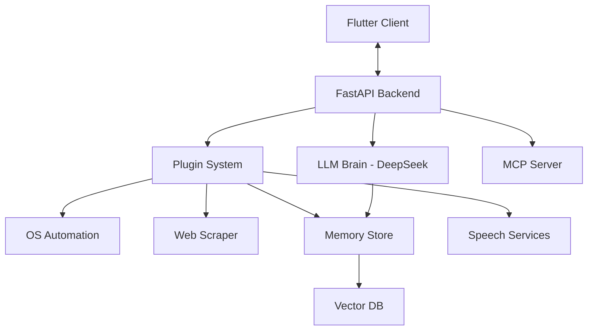
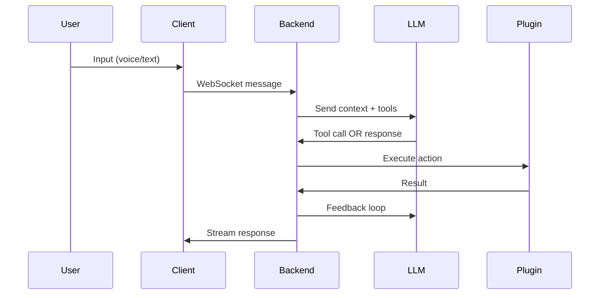
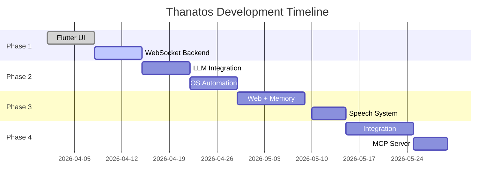

# 🚀 **Thanatos**

### *Modular AI Orchestration Engine for Autonomous Assistants*

> ⚠️ **Status: In Progress (Actively Building & Expanding)**
> This project is under active development. Core architecture is defined, modules are being implemented iteratively.

---

## 🌌 Overview

**Thanatos** is a next-generation, modular AI system designed to function as a **fully autonomous assistant**, capable of:

* Understanding natural language (voice/text)
* Planning multi-step actions
* Executing real-world tasks (OS, web, APIs)
* Learning from interactions (memory)
* Integrating with external AI ecosystems (MCP)

This is not just a chatbot — it’s an **agentic system** with reasoning, execution, and extensibility at its core.

---

## ✨ Key Highlights

* 🧠 **Agentic AI Loop** (Plan → Act → Observe → Iterate)
* 🔌 **Plugin-Based Architecture** (OS, Web, Memory, Speech)
* 📡 **Real-time Streaming via WebSockets**
* 🧩 **Cross-platform Client (Flutter)**
* 🗃️ **Vector Memory (Long-term Recall)**
* 🌍 **MCP Server Integration (External AI Tooling)**
* ⚡ **DeepSeek-powered reasoning engine**

---

## 🏗️ Architecture



---

## 🧠 System Design Philosophy

> **"Loose coupling, strong contracts."**

Each module is:

* Independently developable
* Replaceable
* Scalable

The system is orchestrated through **strict I/O contracts**, making it ideal for:

* experimentation
* scaling
* distributed systems

---

## ⚙️ Tech Stack

<details>
<summary>🧩 Expand to view technologies</summary>

### 🖥️ Client

* **Flutter (Dart)** → Cross-platform UI
* Speech-to-Text integration

### ⚡ Backend

* **FastAPI + Uvicorn** → Async API + WebSockets
* Python (core orchestration)

### 🧠 AI / LLM

* **DeepSeek API** → Planning & reasoning
* HuggingFace → Embeddings (BGE / MiniLM)

### 🗃️ Memory

* **ChromaDB / LanceDB** → Vector storage

### 🌐 Web Automation

* **Playwright** → JS-heavy scraping
* BeautifulSoup → Lightweight parsing

### 💻 OS Automation

* `pyautogui`, `psutil`, `subprocess`

### 🎙️ Speech

* Faster-Whisper → STT
* Edge-TTS / Coqui → TTS

### 🔗 Protocols

* WebSockets → real-time streaming
* MCP → external AI interoperability

</details>

---

## 📂 Project Structure

```bash
thanatos/
│
├── client/                  
│   ├── lib/
│   │   ├── main.dart
│   │   ├── providers/
│   │   └── services/
│
├── backend/                 
│   ├── app/
│   │   ├── main.py
│   │   ├── websocket/
│   │   ├── agent_loop/
│   │   └── schemas/
│
├── plugins/                 
│   ├── os_automation/
│   ├── web_scraper/
│   ├── memory/
│   └── speech/
│
├── llm/                     
│   └── planner.py
│
├── mcp_server/              
│   └── server.py
│
├── shared/                  
│   └── schemas.py
│
├── docker/                  
│
└── README.md
```

---

## 🔄 Agent Workflow



---

## 🧩 Core Modules

### 1. Client Layer (Flutter)

* Chat UI + Voice input
* WebSocket streaming
* Action feedback (Snackbars, Cards)

---

### 2. Orchestration Layer (FastAPI)

* Session management
* Agent loop execution
* Tool dispatching
* Streaming responses

---

### 3. Execution Layer (Plugins)

| Plugin        | Capability                      |
| ------------- | ------------------------------- |
| OS Automation | Open apps, type, control system |
| Web Scraper   | Fetch & summarize web content   |
| Memory        | Store & retrieve knowledge      |
| Speech        | STT + TTS                       |

---

## 🔌 Planned Features

* [ ] Multi-agent collaboration
* [ ] Task scheduling (cron-like AI actions)
* [ ] GUI automation (vision-based)
* [ ] Browser extension integration
* [ ] Mobile notifications + background tasks
* [ ] Plugin marketplace
* [ ] Fine-tuned local LLM fallback
* [ ] Autonomous workflows (goal-based execution)

---

## 🧪 Development Roadmap



---

## 🚀 Getting Started (Planned)

```bash
# Clone repo
git clone https://github.com/Kennny7/Thanatos.git

# Backend
cd backend
pip install -r requirements.txt
uvicorn app.main:app --reload

# Client
cd client
flutter pub get
flutter run
```

---

## 🔐 Design Principles

* **Modularity First**
* **Async Everywhere**
* **Tool-Oriented AI**
* **Local-first where possible**
* **Scalable by design**

---

## 🤖 Vision

> Build a **true personal AI system** that can:

* Understand intent
* Execute complex tasks
* Adapt over time
* Integrate anywhere

---

## 🧑‍💻 Contribution

This project is evolving rapidly. Contributions, ideas, and critiques are welcome.

---

## ⭐ Support

If you like this project:

* ⭐ Star the repo
* 🍴 Fork it
* 🧠 Build your own plugins

---

## 📌 Status

```diff
+ Core architecture defined
+ Development in progress
- Not production ready yet
```

---

## 🔥 Tagline

> **"Not just AI that talks — AI that acts."**

---

If you want, I can also:

* Generate **actual repo folder boilerplate**
* Create **badges (build, license, tech stack)**
* Add **screenshots/UI mockups**
* Or convert this into a **landing page / portfolio showcase**

Just tell me 👍
