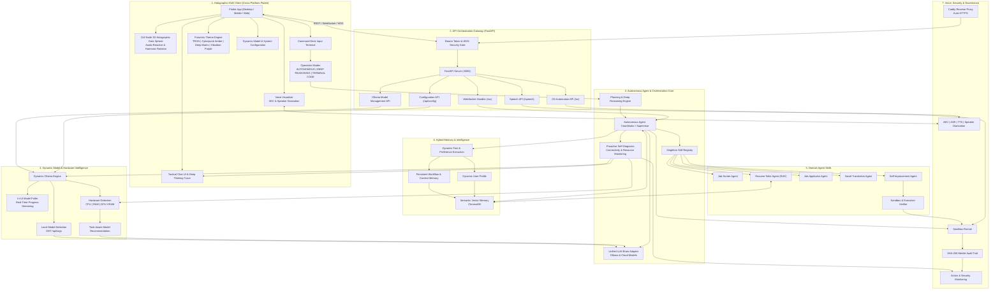

# **Thanatos**

### *Autonomous Multi-Agent AI Assistant Engine with Voice Intelligence & RAG*

<div align="center">

[](https://python.org)
[](https://fastapi.tiangolo.com)
[](https://flutter.dev)
[](https://ollama.com)
[](./tests)
[](./LICENSE)

<br/>

[](#documentation-hub)
[](#quick-start)
[](#system-architecture)
[](#sub-agent-skills--plugin-ecosystem)
[](#contributing)

</div>

---

## Overview

**Thanatos** is an autonomous, local-first multi-agent AI assistant engine designed for cross-platform automation and intelligent personal assistance. Combining local LLM execution via Ollama with multi-agent orchestration, Retrieval-Augmented Generation (RAG), and advanced speech intelligence, Thanatos runs with high privacy, low latency, and zero cloud dependency.

### Core Capabilities

1. **Unified LLM Brain & Deep Thinking**: Local Ollama execution (`qwen2.5:7b`, `deepseek-r1:7b/14b`, `llama3.1:8b`, `phi3`) with real-time `<think>` reasoning streaming and robust tool parsing.
2. **Multi-Agent Supervisor / Coordinator**: Decomposes high-level natural language goals into sub-agent Directed Acyclic Graphs (DAGs).
3. **Speech Intelligence & Speaker Diarization**:
   - **ASR & TTS**: Powered by `faster-whisper` and neural `edge-tts`.
   - **Acoustic Echo Cancellation (AEC)**: Real-time spectral subtraction and noise suppression.
   - **Speaker Diarization**: Distinguishes between "Owner (You)" and "Guest Speaker" using pitch and spectral embeddings.
4. **Hybrid Memory & Career RAG**: ChromaDB vector search integrated with a structured candidate profile manager for context-aware workflows.
5. **Cross-Platform Flutter Client**: Responsive desktop (Windows, macOS, Linux) and mobile (Android, iOS) UI with deep thinking traces, animated voice visualizer, and live agent status tracking.
6. **Zero-Trust Sandbox & Merkle Audit Trail**: Subprocess timeouts, isolated test runners, and SHA-256 tamper-evident cryptographic event logging.

---

## Documentation Hub

Explore the comprehensive technical documentation suite in the [`docs/`](./docs) directory:

| Document | Description | Action |
| :--- | :--- | :---: |
| **Getting Started Guide** | Step-by-step setup guide for Python backend, Ollama models, and Flutter client. | [](./docs/getting_started.md) |
| **Production Deployment Guide** | Step-by-step VPS server deployment, port mappings, Caddy auto-HTTPS, and systemd service templates. | [](./docs/production_deployment.md) |
| **System Architecture** | Component breakdown, supervisor-worker topology, and layer interactions. | [](./docs/architecture.md) |
| **Master Architecture & Workflows** | Authoritative 7-module blueprint with sequence diagrams and execution contracts. | [](./docs/system_architecture_and_workflow.md) |
| **API Specification** | Full REST endpoints and WebSocket streaming protocol (`/ws`) reference. | [](./docs/api_spec.md) |
| **Plugin Development Guide** | Tutorial on creating, registering, and testing custom sub-agent skills. | [](./docs/plugin_dev_guide.md) |
| **Speech Intelligence & AEC** | Voice pipeline, acoustic echo cancellation, and speaker diarization details. | [](./docs/speech_intelligence.md) |
| **Voice Mode & Speaker Verification** | Separate Voice Mode, ECG frequency line, VAD, multi-speaker authorization, and optional camera lip-sync. | [](./docs/voice_mode_speaker_verification.md) |
| **Memory & RAG Subsystem** | ChromaDB vector store, semantic embeddings, and career profile matching. | [](./docs/memory_and_rag.md) |
| **Vector Database Setup Guide** | Detailed setup for embedded ChromaDB, Docker ChromaDB, Qdrant, and Ollama embedding models. | [](./docs/vector_database_setup.md) |
| **Security & Isolation Model** | Sandbox boundaries, OS safety confirmation gates, and Merkle audit logs. | [](./docs/security_model.md) |
| **Security & Network Intelligence** | Authentication gates, network scanning capabilities, OSINT pipelines, and defence mechanisms. | [](./docs/security_and_network.md) |
| **Model Context Protocol (MCP)** | Exposing Thanatos OS tools to Claude Desktop, Cursor IDE, and MCP hosts. | [](./docs/mcp_server.md) |
| **Future Vision: CCTV & Biometrics** | Architectural blueprint for RTSP video stream ingest, YOLO object tracking, and InsightFace recognition. | [](./docs/future_vision_roadmap.md) |
| **Contributor Guide** | Coding conventions, PR guidelines, and running the test suite. | [](./docs/contributing.md) |

---

## System Architecture


```mermaid
flowchart TB

    subgraph ClientLayer ["1. Holographic HUD Client (Cross-Platform Flutter)"]
        FlutterApp["Flutter App (Desktop / Mobile / Web)"]
        ChatUI["Tactical Chat UI & Deep Thinking Trace"]
        HUDSphere["110-Node 3D Holographic Data Sphere<br/>Audio-Reactive & Harmonic Rotation"]
        CommandDeck["Command Deck Input Terminal"]
        ModeSelector["Operation Modes<br/>AUTONOMOUS | DEEP REASONING | TERMINAL CODE"]
        VoiceUI["Voice Visualizer<br/>AEC & Speaker Diarization"]
        ThemeEngine["Futuristic Theme Engine<br/>TRON | Cyberpunk Amber | Deep Matrix | Obsidian Purple"]
        SettingsUI["Dynamic Model & System Configuration"]
    end

    subgraph APILayer ["2. API Orchestration Gateway (FastAPI)"]
        MainApp["FastAPI Server (:8000)"]
        AuthGate["Bearer Token & WSS Security Gate"]
        WSRoute["WebSocket Handler (/ws)"]
        ConfigRoute["Configuration API (/api/config)"]
        SpeechRoute["Speech API (/speech)"]
        OSRoute["OS Automation API (/os)"]
        OllamaRoute["Ollama Model Management API"]
    end

    subgraph CoreEngine ["3. Autonomous Agent & Orchestration Core"]
        Coordinator["Autonomous Agent Coordinator / Supervisor"]
        ReasoningEngine["Planning & Deep Reasoning Engine"]
        UnifiedProvider["Unified LLM Brain Adapter<br/>Ollama & Cloud Models"]
        SelfDiagnosis["Proactive Self-Diagnosis<br/>Connectivity & Resource Monitoring"]
        SkillRegistry["Singleton Skill Registry"]
    end

    subgraph ModelEngine ["4. Dynamic Model & Hardware Intelligence"]
        OllamaManager["Dynamic Ollama Engine"]
        ModelDetection["Local Model Detection<br/>GET /api/tags"]
        ModelPuller["In-UI Model Puller<br/>Real-Time Progress Streaming"]
        HardwareDetector["Hardware Detection<br/>CPU | RAM | GPU VRAM"]
        ModelRecommendation["Task-Aware Model Recommendation"]
    end

    subgraph SubAgents ["5. Domain Agent Skills"]
        JobHunter["Job Hunter Agent"]
        ResumeTailor["Resume Tailor Agent (RAG)"]
        JobApplicator["Job Applicator Agent"]
        NovelAgent["Novel Translation Agent"]
        SelfImprovement["Self-Improvement Agent"]
        SandboxVerifier["Sandbox & Execution Verifier"]
    end

    subgraph IntelligenceMemory ["6. Hybrid Memory & Intelligence"]
        FactExtractor["Dynamic Fact & Preference Extraction"]
        RAGMemory["Semantic Vector Memory<br/>ChromaDB"]
        WorkflowMemory["Persistent Workflow & Context Memory"]
        UserProfile["Dynamic User Profile"]
    end

    subgraph VoiceGovernance ["7. Voice, Security & Governance"]
        SpeechService["AEC | ASR | TTS | Speaker Diarization"]
        SandboxAudit["Sandbox Runner"]
        MerkleAudit["SHA-256 Merkle Audit Trail"]
        SecurityMonitor["Action & Security Monitoring"]
        CaddyProxy["Caddy Reverse Proxy<br/>Auto-HTTPS"]
    end


    %% Client Interactions
    FlutterApp --> ChatUI
    FlutterApp --> HUDSphere
    FlutterApp --> CommandDeck
    CommandDeck --> ModeSelector
    FlutterApp --> VoiceUI
    FlutterApp --> ThemeEngine
    FlutterApp --> SettingsUI

    %% API Communication
    FlutterApp <-->|REST / WebSocket / WSS| AuthGate
    AuthGate --> MainApp
    MainApp --> WSRoute
    MainApp --> ConfigRoute
    MainApp --> SpeechRoute
    MainApp --> OSRoute
    MainApp --> OllamaRoute

    %% Agent Orchestration
    WSRoute --> Coordinator
    ModeSelector --> ReasoningEngine
    ReasoningEngine --> Coordinator
    Coordinator --> UnifiedProvider
    Coordinator --> SkillRegistry
    Coordinator --> SelfDiagnosis

    %% Model Intelligence
    ConfigRoute --> OllamaManager
    OllamaRoute --> OllamaManager
    OllamaManager --> ModelDetection
    OllamaManager --> ModelPuller
    OllamaManager --> HardwareDetector
    HardwareDetector --> ModelRecommendation
    ModelRecommendation --> UnifiedProvider
    ModelDetection --> UnifiedProvider

    %% Agent Skills
    SkillRegistry --> JobHunter
    SkillRegistry --> ResumeTailor
    SkillRegistry --> JobApplicator
    SkillRegistry --> NovelAgent
    SkillRegistry --> SelfImprovement
    SelfImprovement --> SandboxVerifier

    %% Hybrid Memory
    Coordinator --> FactExtractor
    FactExtractor --> UserProfile
    FactExtractor --> WorkflowMemory
    UserProfile --> RAGMemory
    WorkflowMemory --> RAGMemory
    Coordinator <--> RAGMemory
    ResumeTailor <--> RAGMemory

    %% Voice
    SpeechRoute --> SpeechService
    VoiceUI <--> SpeechService

    %% OS Automation & Governance
    OSRoute --> SandboxAudit
    Coordinator --> SandboxAudit
    SandboxVerifier --> SandboxAudit
    SandboxAudit --> MerkleAudit
    MerkleAudit --> SecurityMonitor

    %% Production Deployment
    CaddyProxy --> AuthGate

    %% Self-Diagnosis Feedback
    SelfDiagnosis --> OllamaManager
    SelfDiagnosis --> HardwareDetector
    SelfDiagnosis --> SecurityMonitor
    SelfDiagnosis --> ChatUI
```

---

## Key Workflows

### 1. Autonomous Job Hunting & Resume Tailoring Pipeline
```text
User Prompt ──► Agent Coordinator ──► JobHunter (finds matching tech openings)
                                  ──► ResumeTailor (queries UserProfile RAG & generates custom resume)
                                  ──► JobApplicator (packages application & logs entry)
                                  ──► Streams live progress to Flutter UI
```

### 2. Web Novel Translation & Glossary Polish Pipeline
```text
Chapter Raw Text ──► NovelAgent ──► Translates with glossary term enforcement
                                ──► Polishes prose style & tone
                                ──► Returns structured bilingual chapter output
```

### 3. Self-Improvement Code Reflection Pipeline
```text
Codebase Inspection ──► SelfImprovement Agent ──► Analyzes target file
                                              ──► Proposes fix / refactor
                                              ──► Runs tests inside Sandbox
                                              ──► Commits verified patch
```

### 4. Multi-Speaker Voice Intelligence & Diarization
```text
Microphone Audio ──► AEC Processor (removes acoustic echo & noise)
                 ──► Speaker Identifier (extracts pitch/spectral features vs Owner profile)
                 ──► Faster-Whisper ASR (transcribes multi-speaker audio with timestamps)
                 ──► Agent Loop (handles directives like "summarize what others said")
```

---

## Sub-Agent Skills & Plugin Ecosystem

Thanatos features a pluggable skill architecture where every domain agent implements `BaseSkill` and registers with `SkillRegistry`:

| Skill Identifier | Tools Provided | Functional Scope |
| :--- | :--- | :--- |
| `job_hunter` | `search_jobs` | Scrapes tech openings by role and location (e.g. Pune freshers). |
| `resume_tailor` | `tailor_resume` | Queries RAG career memory and generates tailored resumes and cover letters. |
| `job_applicator` | `prepare_job_application` | Formulates application submission packages and logs history. |
| `novel_agent` | `translate_and_edit_novel` | Translates raw novel chapters with glossary consistency. |
| `self_improvement` | `self_improve_code` | Inspects architecture, runs sandbox tests, and validates code improvements. |
| `web_search` | `search_web`, `search_news` | Live internet queries and breaking news via Google News RSS & DuckDuckGo. |

*To build a custom skill, refer to the [Plugin Development Guide](./docs/plugin_dev_guide.md).*

---

## Tactical Voice Mode & Speaker Biometrics

Thanatos features a dedicated **Voice Mode** alongside standard Text Mode, designed for hands-free operations:

- **ECG / Cardiogram Frequency Waveform**: Live animated pulse wave visualizer that sweeps and modulates in real-time based on audio frequency (idle rhythm, user speaking bursts, AI neural speech harmonics).
- **Voice Activity Detection (VAD)**: Continuously evaluates energy thresholds and human vocal spectral boundaries (75 Hz to 3800 Hz) to detect speech without clipping.
- **Multi-Speaker Diarization & Authorization**:
  - **Owner (Boss)**: Primary enrolled voice profile with full administrative directive privileges.
  - **Authorized Delegates**: Approved team members or operators enrolled to issue permitted tasks.
  - **Unauthorized Guests**: Third-party speech is detected, flagged, and rejected by the agent authorization guard to prevent accidental or malicious execution.
- **Optional Camera Module (Face Recognition & Lip Tracking)**:
  - Real-time webcam viewfinder tracking the user's face.
  - Measures Mouth Aspect Ratio (MAR) and optical pixel variance to verify if the Boss is physically speaking on camera, preventing voice-spoofing or off-camera background audio execution.
  - Uses standard OpenCV Haar Cascades with zero mandatory cloud dependencies.

*For complete technical details and architecture, see [Voice Mode & Speaker Verification Specification](./docs/voice_mode_speaker_verification.md).*

---

## Quick Start

### 1. Prerequisites
- **Python 3.12+**
- **Flutter SDK 3.x** (for desktop/mobile/web client)
- **Ollama** (for local LLM execution: `ollama run qwen2.5:7b` or `deepseek-r1:7b`)
- *(Optional)* **OpenCV** for camera facial tracking: `pip install opencv-python`

### 2. Backend Setup
```bash
# Clone the repository
git clone https://github.com/Kennny7/Thanatos.git
cd Thanatos

# Create and activate virtual environment
python -m venv venv
venv\Scripts\activate      # On Windows
source venv/bin/activate    # On Linux/macOS

# Install dependencies
pip install -r requirements.txt

# Start the FastAPI server
uvicorn apps.api_server.main:app --host 0.0.0.0 --port 8000 --reload
```
### 3. Environment & Variable Configuration

Copy `.env.example` to `.env` in the root directory to customize configuration settings:

```bash
cp .env.example .env
```

Key configuration parameters handled via `.env` file or environment variables:

- LLM Settings:
  - `LLM_PROVIDER`: LLM provider identifier (default: `ollama`).
  - `LLM_MODEL`: Active model name (default: `qwen2.5:7b`).
  - `LLM_BASE_URL`: Connection URL for local LLM service (default: `http://localhost:11434`).
  - `DEEPSEEK_API_KEY`: API key for DeepSeek cloud service.
  - `OPENAI_API_KEY`: API key for OpenAI API endpoint.
- Memory & Vector Database (ChromaDB):
  - `MEMORY_PERSIST_DIR`: Persistence storage path for ChromaDB vector database (default: `./memory_store`).
  - `MEMORY_COLLECTION`: Vector database collection name (default: `thanatos_memories`).
  - `EMBEDDING_MODEL`: Embedding model name for local RAG (default: `all-MiniLM-L6-v2`).
  - `EMBEDDING_DEVICE`: Computing device for embedding generation (default: `cpu`).
- User Profile & Personal Data Defaults:
  - `USER_NAME`: User display name in system context (default: `User`).
  - `USER_EMAIL`: User contact email address (default: `user@example.com`).
  - `USER_LOCATION`: Location context for localized skills.
  - `USER_TITLE`: Professional title context.
- Speech & Voice Settings:
  - `TTS_VOICE`: Voice identifier for Text-to-Speech (default: `en-US-AriaNeural`).
  - `STT_MODEL`: Faster-Whisper model size for Speech-to-Text (default: `base`).
  - `SPEAKER_ENROLLMENT_DIR`: Storage path for speaker enrollment profiles (default: `./voice_profiles`).

### 4. Local Model Setup (Ollama)
```bash
# Pull recommended models
ollama pull qwen2.5:7b
ollama pull deepseek-r1:7b
```

### 5. Flutter Client Setup
```bash
cd apps/client_flutter

# Install Flutter dependencies
flutter pub get

# Run on your desktop platform
flutter run -d windows    # Windows Desktop
# or
flutter run -d macos      # macOS Desktop
# or
flutter run -d chrome     # Web Browser
```

### 6. Running the Test Suite
```bash
# Run all 48 unit and integration tests
pytest tests -v
```

---

## Project Structure

```text
Thanatos
|-- apps/
|   |-- api_server/               # FastAPI backend with WebSockets & REST routers
|   |   |-- core/                 # Agent loop, dispatcher, session manager
|   |   |-- routes/               # WebSocket, config, speech, health, OS routes
|   |   `-- schemas/              # Pydantic v2 communication models
|   |-- client_flutter/           # Cross-platform Flutter application
|   |   |-- lib/models/           # Message, thought, and agent models
|   |   |-- lib/state/            # Riverpod state management & WebSocket provider
|   |   `-- lib/ui/               # Chat screen, voice visualizer, settings & tracker
|   `-- mcp_server/               # Model Context Protocol (MCP) server for Claude / Cursor
|-- services/
|   |-- llm_brain/                # Unified LLM provider & multi-agent coordinator
|   |-- local_llm/                # Ollama client with dynamic model discovery
|   |-- memory/                   # VectorStore (ChromaDB), MemoryManager & UserProfile
|   |-- speech/                   # STT, TTS, AEC processor & Speaker Diarization
|   `-- os_automation/            # System control & OS interaction
|-- plugins/
|   |-- base/                     # BaseSkill interface & SkillRegistry
|   `-- system_skills/            # Domain skills (Job hunter, resume tailor, applicator, novel, self-improvement)
|-- sandbox/                      # Subprocess limiter & Docker container isolation
|-- audit/                        # Tamper-evident Merkle hash audit logger
|-- docs/                         # Comprehensive technical documentation suite
`-- tests/                        # Full test suite (48 tests passing)
```

---

## Contributing

We welcome contributions from the community. Please read our [Contributor Guide](./docs/contributing.md) to learn about our development process, coding standards, and how to submit pull requests.

---

## License

This project is licensed under the Apache 2.0 License. See the [LICENSE](./LICENSE) file for details.
