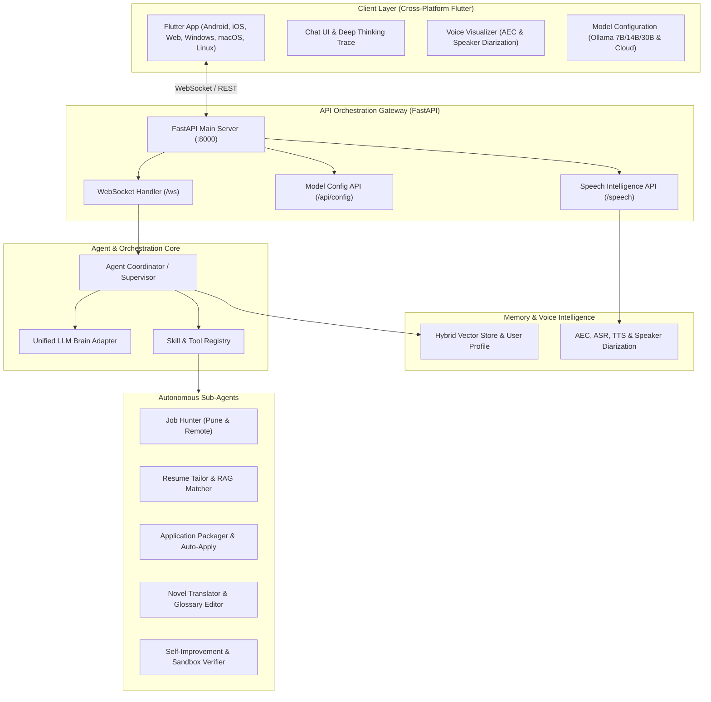

# **Thanatos**

### *Autonomous Multi-Agent AI Assistant Engine with Voice Intelligence & RAG*

[](https://python.org)
[](https://fastapi.tiangolo.com)
[](https://flutter.dev)
[](https://ollama.com)
[](./tests)

---

## 🌟 Overview

**Thanatos** is an autonomous, multi-agent AI assistant designed for seamless cross-platform personal and professional automation. Built with a local-first philosophy and scalable agent coordination, Thanatos combines:

1. **Unified LLM Brain & Deep Thinking**: Local Ollama support (7B / 14B / 30B models such as `qwen2.5:7b`, `llama3.1:8b`, `deepseek-r1:7b/14b`, `phi3`) with dynamic model switching, native tool calling, and embedded XML/JSON `<tool_call>` & `<think>` extraction.
2. **Scalable Multi-Agent Coordinator**: A supervisor architecture that orchestrates specialized sub-agents into end-to-end task pipelines.
3. **Domain Agent Skills**:
   - 🎯 **Job Hunter Agent**: Scrapes and analyzes tech openings (e.g. Pune fresher roles).
   - 📄 **Resume Tailor Agent**: RAG-powered engine tailoring resumes and cover letters against user profile data.
   - 📮 **Job Applicator Agent**: Stages and logs job application submissions.
   - 📖 **Novel Translation & Editor Agent**: Translates web novel pages, maintaining style consistency and terminology glossaries.
   - 🔧 **Self-Improvement Code Agent**: Analyzes the Thanatos codebase, runs sandbox tests, and safely validates code patches.
4. **Speech Intelligence & Speaker Diarization**:
   - **ASR & TTS**: Powered by Faster-Whisper and Edge-TTS.
   - **Acoustic Echo Cancellation (AEC)**: Spectral gating and feedback suppression.
   - **Speaker Identification & Diarization**: Enrolls the owner's voice and tags speakers in multi-person environments ("Owner (You)" vs "Guest Speaker").
5. **Memory & RAG Subsystem**: ChromaDB vector store with semantic search fallback and candidate career profile manager.
6. **Cross-Platform UI (Flutter)**: Responsive desktop and mobile UI with live agent progress tracking, thought streaming, voice overlay, and model switching.

---

## 🏗️ System Architecture


```mermaid
flowchart TB
    subgraph ClientLayer ["Client Layer (Cross-Platform Flutter)"]
        FlutterApp["Flutter App (Android, iOS, Web, Windows, macOS, Linux)"]
        ChatUI["Chat UI & Deep Thinking Trace"]
        VoiceUI["Voice Visualizer (AEC & Speaker Diarization)"]
        SettingsUI["Model Configuration (Ollama 7B/14B/30B & Cloud)"]
    end

    subgraph APILayer ["API Orchestration Gateway (FastAPI)"]
        MainApp["FastAPI Main Server (:8000)"]
        WSRoute["WebSocket Handler (/ws)"]
        ConfigRoute["Model Config API (/api/config)"]
        SpeechRoute["Speech Intelligence API (/speech)"]
    end

    subgraph CoreEngine ["Agent & Orchestration Core"]
        Coordinator["Agent Coordinator / Supervisor"]
        UnifiedProvider["Unified LLM Brain Adapter"]
        SkillRegistry["Skill & Tool Registry"]
    end

    subgraph SubAgents ["Autonomous Sub-Agents"]
        JobHunter["Job Hunter (Pune & Remote)"]
        ResumeTailor["Resume Tailor & RAG Matcher"]
        JobApplicator["Application Packager & Auto-Apply"]
        NovelAgent["Novel Translator & Glossary Editor"]
        SelfImprovement["Self-Improvement & Sandbox Verifier"]
    end

    subgraph MemoryVoice ["Memory & Voice Intelligence"]
        RAGMemory["Hybrid Vector Store & User Profile"]
        SpeechService["AEC, ASR, TTS & Speaker Diarization"]
    end

    FlutterApp <-->|WebSocket / REST| MainApp
    MainApp --> WSRoute & ConfigRoute & SpeechRoute
    WSRoute --> Coordinator --> UnifiedProvider
    Coordinator --> SkillRegistry --> SubAgents
    Coordinator --> RAGMemory
    SpeechRoute --> SpeechService
```

---

## 🚀 Key Workflows

### 1. Autonomous Job Hunting & Tailored Application Pipeline
When prompted (e.g., *"Search for freshers jobs in Pune and apply"*):
```
User Prompt ──► Agent Coordinator ──► JobHunter (finds matching Pune tech roles)
                                  ──► ResumeTailor (queries UserProfile RAG & generates custom resume)
                                  ──► JobApplicator (packages application & logs entry)
                                  ──► Streams live progress to Flutter UI
```

### 2. Web Novel Translation & Polishing Pipeline
When translating foreign web novel chapters:
```
Chapter Raw Text ──► NovelAgent ──► Translates with glossary term enforcement
                                ──► Polishes prose style & tone
                                ──► Returns structured bilingual chapter output
```

### 3. Self-Improvement Code Reflection Pipeline
When tasked with code evolution:
```
Codebase Inspection ──► SelfImprovement Agent ──► Analyzes target file
                                              ──► Proposes fix / refactor
                                              ──► Runs tests inside Sandbox
                                              ──► Commits verified patch
```

### 4. Multi-Speaker Voice Intelligence & Diarization
```
Microphone Audio ──► AEC Processor (removes acoustic echo & noise)
                 ──► Speaker Identifier (extracts pitch/spectral features vs Owner profile)
                 ──► Faster-Whisper ASR (transcribes multi-speaker audio with timestamps)
                 ──► Agent Loop (handles directives like "listen to what others said")
```

---

## 📂 Project Structure

```text
Thanatos
├── apps/
│   ├── api_server/               # FastAPI backend with WebSockets & REST routers
│   │   ├── core/                 # Agent loop, dispatcher, and session manager
│   │   ├── routes/               # WebSocket, config, speech, health, OS routes
│   │   └── schemas/              # Pydantic v2 communication models
│   └── client_flutter/           # Cross-platform Flutter application
│       ├── lib/models/           # Message, thought, and active agent models
│       ├── lib/state/            # Riverpod state management & WebSocket provider
│       └── lib/ui/               # Chat screen, voice visualizer, settings & tracker
├── services/
│   ├── llm_brain/                # Unified LLM provider & multi-agent coordinator
│   ├── local_llm/                # Ollama client with dynamic model discovery
│   ├── memory/                   # VectorStore (ChromaDB), MemoryManager & UserProfile
│   ├── speech/                   # STT, TTS, AEC processor & Speaker Diarization
│   └── os_automation/            # System control & OS interaction
├── plugins/
│   ├── base/                     # BaseSkill interface & SkillRegistry
│   └── system_skills/            # Job hunter, resume tailor, applicator, novel & self-improvement
├── sandbox/                      # Isolated subprocess / Docker execution runner
├── audit/                        # Tamper-evident cryptographic Merkle audit logger
├── docs/                         # Canonical architecture & technical specifications
└── tests/                        # Comprehensive unit and integration test suite (48 tests)
```

---

## ⚡ Quick Start

### 1. Prerequisites
- Python 3.12+
- Flutter SDK (for desktop/mobile client)
- Ollama (optional for local LLM execution: `ollama run qwen2.5:7b` or `deepseek-r1:7b`)

### 2. Backend Setup
```bash
# Clone the repository
git clone https://github.com/Kennny7/Thanatos.git
cd Thanatos

# Create and activate virtual environment
python -m venv .venv
.venv\Scripts\activate      # On Windows
source .venv/bin/activate    # On Linux/macOS

# Install dependencies
pip install -r requirements.txt

# Start the FastAPI server
uvicorn apps.api_server.main:app --host 0.0.0.0 --port 8000 --reload
```

### 3. Flutter Client Setup
```bash
cd apps/client_flutter

# Install Flutter packages
flutter pub get

# Run on your current platform (Windows, macOS, Linux, Chrome, Android, iOS)
flutter run
```

### 4. Running the Test Suite
```bash
# Run all 48 unit and integration tests
pytest tests -v
```

---

## 📖 Documentation Index

| Document | Description |
| :--- | :--- |
| 📄 **[Master Architecture & Workflow Specification](./docs/system_architecture_and_workflow.md)** | Authoritative blueprint covering all 7 modules, sequence diagrams, and data flows. |
| 📄 **[API Specification](./docs/api_spec.md)** | Detailed documentation for REST endpoints and WebSocket protocols. |
| 📄 **[Plugin Development Guide](./docs/plugin_dev_guide.md)** | Guide for creating, registering, and testing new sub-agent skills. |
| 📄 **[Security Model](./docs/security_model.md)** | Sandbox isolation boundaries and cryptographic audit logging. |

---

## 📄 License
This project is licensed under the Apache 2.0 License.
