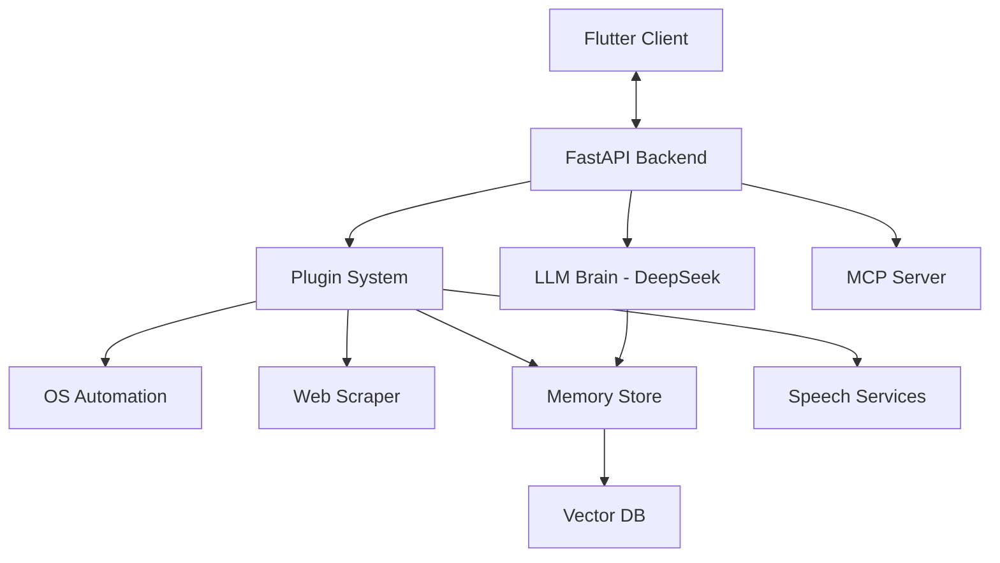
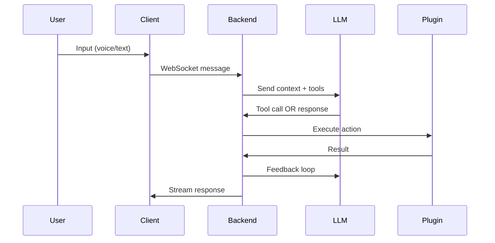

# **Thanatos**

### *Modular AI Orchestration Engine for Autonomous Assistants*

> [!] **Status: In Progress (Actively Building & Expanding)**
> This project is under active development. Core architecture is defined, modules are being implemented iteratively.

---

## [+] Overview

**Thanatos** is a next-generation, modular AI system designed to function as a **fully autonomous assistant**, capable of:

* Understanding natural language (voice/text)
* Planning multi-step actions
* Executing real-world tasks (OS, web, APIs)
* Learning from interactions (memory)
* Integrating with external AI ecosystems (MCP)

This is not just a chatbot — it’s an **agentic system** with reasoning, execution, and extensibility at its core.

---

## [+] Key Highlights

* **Agentic AI Loop** (Plan → Act → Observe → Iterate)
* **Plugin-Based Architecture** (OS, Web, Memory, Speech)
* **Real-time Streaming via WebSockets**
* **Cross-platform Client (Flutter)**
* **Vector Memory (Long-term Recall)**
* **MCP Server Integration (External AI Tooling)**
* **DeepSeek-powered reasoning engine**

---

## [+] Architecture


```mermaid
flowchart TD
    A[Flutter Client] <--> B[FastAPI Backend]
    B --> C[LLM Brain - DeepSeek]
    B --> D[Plugin System]

    D --> E[OS Automation]
    D --> F[Web Scraper]
    D --> G[Memory Store]
    D --> H[Speech Services]

    G --> I[Vector DB]
    C --> G

    B --> J[MCP Server]
```

---

## [+] System Design Philosophy

> **"Loose coupling, strong contracts."**

Each module is:

* Independently developable
* Replaceable
* Scalable

The system is orchestrated through **strict I/O contracts**, making it ideal for:

* experimentation
* scaling
* distributed systems

---

## [+] Tech Stack

<details>
<summary>Expand to view technologies</summary>

### Client

* **Flutter (Dart)** → Cross-platform UI
* Speech-to-Text integration

### Backend

* **FastAPI + Uvicorn** → Async API + WebSockets
* Python (core orchestration)

### AI / LLM

* **DeepSeek API** → Planning & reasoning
* HuggingFace → Embeddings (BGE / MiniLM)

### Memory

* **ChromaDB / LanceDB** → Vector storage

### Web Automation

* **Playwright** → JS-heavy scraping
* BeautifulSoup → Lightweight parsing

### OS Automation

* `pyautogui`, `psutil`, `subprocess`

### Speech

* Faster-Whisper → STT
* Edge-TTS / Coqui → TTS

### Protocols

* WebSockets → real-time streaming
* MCP → external AI interoperability

</details>

---

## [+] Project Structure

```bash
Thanatos/
│
├── README.md
├── LICENSE
├── pyproject.toml
├── docker-compose.yml
├── .env.example
│
├── apps/                           # Entry points (user-facing + API)
│   │
│   ├── client_flutter/             # Cross-platform Flutter app
│   │   ├── lib/
│   │   │   ├── main.dart
│   │   │   ├── ui/
│   │   │   │   ├── screens/
│   │   │   │   │   └── chat_screen.dart
│   │   │   │   └── widgets/
│   │   │   │       ├── chat_bubble.dart
│   │   │   │       └── action_card.dart
│   │   │   │
│   │   │   ├── state/
│   │   │   │   └── chat_provider.dart
│   │   │   │
│   │   │   ├── services/
│   │   │   │   ├── websocket_service.dart
│   │   │   │   ├── speech_service.dart
│   │   │   │   └── api_service.dart
│   │   │   │
│   │   │   └── models/
│   │   │       └── message_model.dart
│   │   │
│   │   ├── pubspec.yaml
│   │   └── test/
│   │
│   ├── api_server/                 # FastAPI orchestration layer
│   │   ├── main.py
│   │   ├── routes/
│   │   │   ├── websocket.py
│   │   │   ├── health.py
│   │   │   └── speech.py
│   │   │
│   │   ├── core/
│   │   │   ├── session_manager.py
│   │   │   ├── agent_loop.py
│   │   │   ├── dispatcher.py
│   │   │   └── config.py
│   │   │
│   │   ├── schemas/
│   │   │   ├── websocket_models.py
│   │   │   ├── agent_models.py
│   │   │   └── tool_models.py
│   │   │
│   │   └── dependencies.py
│   │
│   └── mcp_server/                 # External tool exposure (MCP)
│       ├── server.py
│       └── tools/
│           ├── system_tools.py
│           └── app_tools.py
│
├── services/                       # Independent execution modules
│   │
│   ├── llm_brain/
│   │   ├── deepseek_planner.py
│   │   ├── tool_router.py
│   │   └── prompt_templates/
│   │       ├── system_prompt.txt
│   │       └── tool_schema.json
│   │
│   ├── local_llm/
│   │   ├── adapter_server.py
│   │   ├── ollama_client.py
│   │   ├── prompt_builder.py
│   │   └── tool_parser.py
│   │
│   ├── memory/
│   │   ├── memory_manager.py
│   │   ├── vector_store.py
│   │   └── embeddings.py
│   │
│   ├── speech/
│   │   ├── stt.py
│   │   ├── tts.py
│   │   └── audio_utils.py
│   │
│   ├── web/
│   │   ├── scraper.py
│   │   ├── search.py
│   │   └── parser.py
│   │
│   └── os_automation/
│       ├── __init__.py
│       ├── router.py
│       ├── exceptions.py
│       ├── system_control.py
│       ├── process_manager.py
│       └── input_controller.py
│
├── plugins/                        # Skill-based modular extensions
│   │
│   ├── base/
│   │   ├── skill_interface.py
│   │   └── registry.py
│   │
│   ├── system_skills/
│   │   ├── file_manager/
│   │   ├── process_control/
│   │   └── resource_monitor/
│   │
│   ├── security_skills/
│   │   ├── network_scanner/
│   │   ├── vulnerability_analysis/
│   │   ├── phishing_detector/
│   │   └── malware_sandbox/
│   │
│   ├── web_tools/
│   │   └── scraping_tools/
│   │
│   └── custom_skills/
│
├── sandbox/                        # Isolated execution layer
│   ├── docker_manager.py
│   ├── wsl_adapter.py
│   ├── resource_limiter.py
│   └── security_profiles/
│       ├── apparmor/
│       └── selinux/
│
├── audit/                          # Security & forensic logging
│   ├── audit_logger.py
│   ├── crypto_utils.py
│   ├── chain_manager.py
│   └── storage/
│       └── audit.db
│
├── config/
│   ├── permissions.yaml            # RBAC policies
│   ├── logging.conf
│   ├── settings.py
│   └── secrets.env
│
├── shared/                         # Cross-service contracts
│   ├── models/
│   │   ├── agent_event.py
│   │   ├── tool_definition.py
│   │   └── tool_result.py
│   ├── deepseek_planner.py
│   ├── constants.py
│   ├── settings.py
│   └── utils.py
│
├── tests/
│   ├── unit/
│   │   ├── test_agent.py
│   │   ├── test_plugins.py
│   │   └── test_memory.py
│   │
│   ├── integration/
│   │   ├── test_api.py
│   │   ├── test_workflow.py
│   │	└── test_planner.py
│   └── security/
│       ├── test_sandbox.py
│       └── test_audit_integrity.py
│
├── infra/                          # Deployment & DevOps
│   ├── docker/
│   │   ├── Dockerfile.api
│   │   ├── Dockerfile.worker
│	│	├── Dockerfile.ollama
│	│	├── Dockerfile.local_llm
│   │   └── Dockerfile.playwright
│   │
│   ├── k8s/
│   │   ├── deployment.yaml
│   │   ├── service.yaml
│   │   └── secrets.yaml
│   │
│   └── ci_cd/
│       └── github_actions.yml
│
└── docs/
    ├── architecture.md
    ├── api_spec.md
    ├── plugin_dev_guide.md
    └── security_model.md
```

---

## 🔄 Agent Workflow


```mermaid
sequenceDiagram
    participant User
    participant Client
    participant Backend
    participant LLM
    participant Plugin

    User->>Client: Input (voice/text)
    Client->>Backend: WebSocket message
    Backend->>LLM: Send context + tools
    LLM->>Backend: Tool call OR response
    Backend->>Plugin: Execute action
    Plugin->>Backend: Result
    Backend->>LLM: Feedback loop
    Backend->>Client: Stream response
```

---

## [+] Core Modules

### 1. Client Layer (Flutter)

* Chat UI + Voice input
* WebSocket streaming
* Action feedback (Snackbars, Cards)

---

### 2. Orchestration Layer (FastAPI)

* Session management
* Agent loop execution
* Tool dispatching
* Streaming responses

---

### 3. Execution Layer (Plugins)

| Plugin        | Capability                      |
| ------------- | ------------------------------- |
| OS Automation | Open apps, type, control system |
| Web Scraper   | Fetch & summarize web content   |
| Memory        | Store & retrieve knowledge      |
| Speech        | STT + TTS                       |

---

## 🔌 Planned Features

* [ ] Multi-agent collaboration
* [ ] Task scheduling (cron-like AI actions)
* [ ] GUI automation (vision-based)
* [ ] Browser extension integration
* [ ] Mobile notifications + background tasks
* [ ] Plugin marketplace
* [ ] Fine-tuned local LLM fallback
* [ ] Autonomous workflows (goal-based execution)

---

## [+] Getting Started (Planned)

```bash
# Clone repo
git clone https://github.com/Kennny7/Thanatos.git

# Backend
cd backend

# Create environment file
cp .env.example .env

# Install dependencies
pip install -e .
# OR
pip install -r requirements.txt

# Install Playwright browser
playwright install chromium

# Start API
uvicorn app.main:app --reload

# Client
cd ../client
flutter pub get
flutter run
```

---

## [+] Design Principles

* **Modularity First**
* **Async Everywhere**
* **Tool-Oriented AI**
* **Local-first where possible**
* **Scalable by design**

---

## [+] Vision

> Build a **true personal AI system** that can:

* Understand intent
* Execute complex tasks
* Adapt over time
* Integrate anywhere

---

## [+] Contribution

This project is evolving rapidly. Contributions, ideas, and critiques are welcome.

---

## [+] Support

If you like this project:

* Star the repo
* Fork it
* Build your own plugins

---

## [+] Status

```diff
+ Core architecture defined
+ Development in progress
- Not production ready yet
```

---

## [+] Tagline

> **"Not just AI that talks — AI that acts."**
