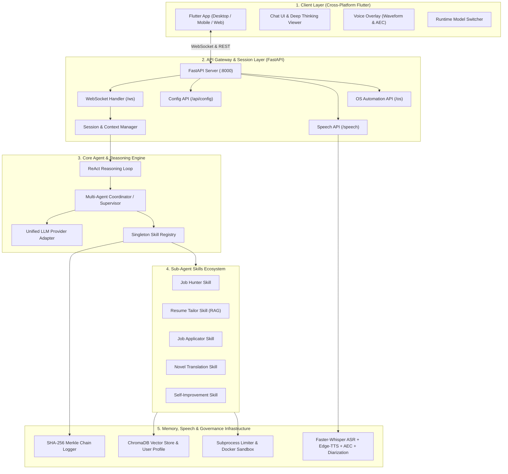

# Thanatos System Architecture

This document provides a comprehensive architectural breakdown of Thanatos, explaining its component design, communication protocols, multi-agent coordination patterns, and data flows.

For the full detailed module-by-module reference, see the **[Master Architecture & Workflow Specification](./system_architecture_and_workflow.md)**.

---

## 📑 Table of Contents

- [1. Architectural Overview](#1-architectural-overview)
- [2. Multi-Layer System Topology](#2-multi-layer-system-topology)
- [3. Subsystem Breakdown](#3-subsystem-breakdown)
  - [3.1 Client Layer (Flutter UI)](#31-client-layer-flutter-ui)
  - [3.2 API Orchestration Gateway (FastAPI)](#32-api-orchestration-gateway-fastapi)
  - [3.3 LLM Brain & Unified Provider](#33-llm-brain--unified-provider)
  - [3.4 Multi-Agent Coordinator & Skills](#34-multi-agent-coordinator--skills)
  - [3.5 Memory & RAG Knowledge Store](#35-memory--rag-knowledge-store)
  - [3.6 Speech Intelligence & Audio Engine](#36-speech-intelligence--audio-engine)
  - [3.7 Sandbox & Merkle Audit Trail](#37-sandbox--merkle-audit-trail)
- [4. Cross-Cutting Design Patterns](#4-cross-cutting-design-patterns)
- [5. Data Flow & Execution Pipelines](#5-data-flow--execution-pipelines)

---

## 1. Architectural Overview

Thanatos is engineered around a **local-first, micro-orchestrated multi-agent architecture**. It allows users to interact through natural speech and rich chat interfaces, delegating complex tasks to specialized sub-agents running locally on standard consumer hardware.

### Key Architectural Tenets
- **Local-First Autonomy**: Default execution via local Ollama models (e.g., `qwen2.5:7b`, `deepseek-r1:14b`) ensuring privacy and offline capability.
- **Supervisor-Worker Agent Hierarchy**: High-level goals are received by a central Coordinator, which generates execution sub-graphs and delegates to domain-specific skills.
- **Unified Data Contracts**: Shared Pydantic v2 schemas ensure interoperability across API routes, WebSocket frames, tool definitions, and Flutter state models.
- **Resilient Fallbacks**: Automatic XML/JSON parsing repair for tool calls from compact 7B/8B parameter models.

---

## 2. Multi-Layer System Topology



---

## 3. Subsystem Breakdown

### 3.1 Client Layer (Flutter UI)
Located in `apps/client_flutter/`, this cross-platform client runs on Windows, macOS, Linux, Android, iOS, and Web.
- **State Management**: Built with Riverpod (`ChatProvider`, `SettingsProvider`).
- **Real-Time Streaming**: Listens to WebSocket frames, dynamically rendering deep thinking traces, markdown with syntax-highlighted code blocks, and live sub-agent status breadcrumbs.
- **Voice Overlay**: Visualizes real-time mic volume and active speaker labels ("Owner (You)" vs "Guest").

### 3.2 API Orchestration Gateway (FastAPI)
Located in `apps/api_server/`, provides async REST endpoints and full-duplex WebSocket connections.
- **Session Management**: `SessionManager` tracks conversation history, active generators, and token buffers.
- **Heartbeat & Reconnection**: Emits periodic ping-pong heartbeats every 15 seconds.

### 3.3 LLM Brain & Unified Provider
Located in `services/llm_brain/` and `services/local_llm/`.
- **UnifiedLLMProvider**: Unified interface wrapping Ollama, DeepSeek, OpenAI, and Anthropic.
- **Tool Parser**: Extracts `<tool_call>` JSON/XML envelopes from smaller models without native function-calling support.
- **Deep Thinking Parser**: Extracts `<think>` tags to stream internal model reasoning separately from the final answer.

### 3.4 Multi-Agent Coordinator & Skills
Located in `services/llm_brain/coordinator.py` and `plugins/`.
- **Coordinator**: Analyzes user intent, builds DAGs of subtasks, dispatches calls to registered skills, and synthesizes consolidated responses.
- **Plugin System**: Every skill inherits from `BaseSkill` and registers with `SkillRegistry`.

### 3.5 Memory & RAG Knowledge Store
Located in `services/memory/`.
- **VectorStore**: ChromaDB-backed vector database for semantic search and document retrieval.
- **UserProfile**: Structured user profile repository storing career history, education, and technical competencies for RAG matching.

### 3.6 Speech Intelligence & Audio Engine
Located in `services/speech/`.
- **AEC & VAD**: Spectral subtraction, noise suppression, and voice activity detection.
- **ASR**: `faster-whisper` for fast, accurate speech-to-text.
- **Speaker Diarization**: Pitch and spectral centroid feature extraction to distinguish user voice from guest speakers.
- **TTS**: `edge-tts` for high-quality neural voice synthesis.

### 3.7 Sandbox & Merkle Audit Trail
Located in `sandbox/` and `audit/`.
- **Sandbox**: Subprocess execution limiter and Docker container isolation for safe code execution.
- **Audit Logger**: Cryptographically sealed hash chain recording all agent actions.

---

## 4. Cross-Cutting Design Patterns

| Pattern | Implementation | Purpose |
| :--- | :--- | :--- |
| **Supervisor Pattern** | `Coordinator` | Orchestrates specialized sub-agents into sequential or parallel pipelines. |
| **Adapter Pattern** | `UnifiedLLMProvider` | Provides a consistent API across diverse local and cloud LLM backends. |
| **Plugin / Registry** | `SkillRegistry` | Decouples domain skills from the core engine, allowing zero-downtime additions. |
| **Envelope Pattern** | `ToolCall` / `ToolResult` | Standardizes parameter passing, error encapsulation, and serialization. |
| **Merkle Hash Chain** | `ChainManager` | Guarantees tamper-evident audit logging for autonomous actions. |

---

## 5. Data Flow & Execution Pipelines

### Example: Multi-Agent Job Hunting & Resume Tailoring Flow

```
[User Prompt: "Find freshers jobs in Pune & tailor my resume"]
                      │
                      ▼
            [FastAPI WebSocket]
                      │
                      ▼
           [Agent ReAct Loop]
                      │
                      ▼
         [Multi-Agent Coordinator]
        ┌─────────────┴─────────────┐
        ▼                           ▼
[JobHunterSkill]           [Memory RAG Manager]
(Finds tech roles)         (Fetches User Profile)
        │                           │
        └─────────────┬─────────────┘
                      ▼
            [ResumeTailorSkill]
         (Generates tailored resume)
                      │
                      ▼
           [JobApplicatorSkill]
         (Stages application pack)
                      │
                      ▼
            [Unified LLM Brain]
         (Synthesizes summary response)
                      │
                      ▼
             [Flutter Client UI]
```
