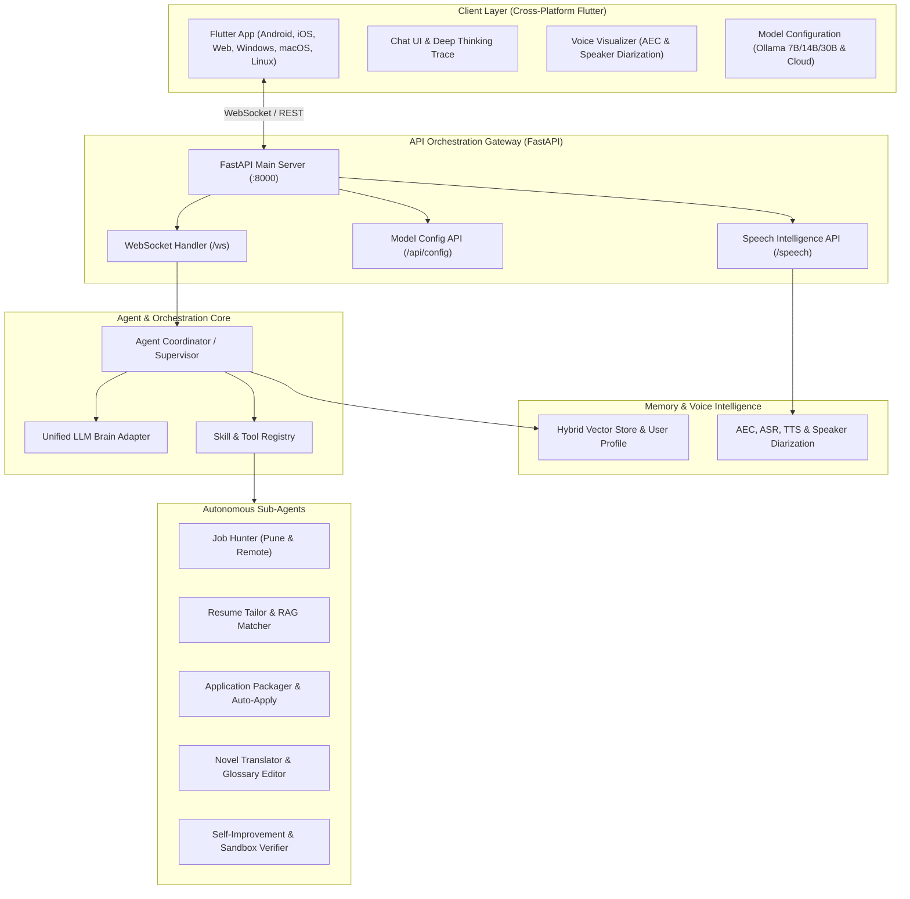

# Thanatos Architecture Specification

> **Canonical Document Notice**:
> The complete, authoritative, and in-depth architecture and workflow documentation for Thanatos is located at:
> 📄 **[`docs/system_architecture_and_workflow.md`](./system_architecture_and_workflow.md)**

---

## Quick Reference Architecture

For full details regarding multi-agent pipelines, data flows, cryptographic audit logs, and directory layout, please refer to the **[Master Architecture & Workflow Specification](./system_architecture_and_workflow.md)**.
