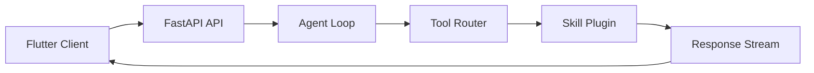
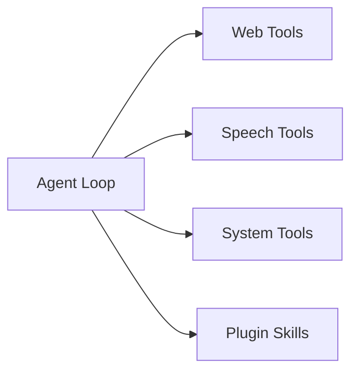

# Thanatos Architecture

## Overview

Thanatos is a modular AI assistant platform designed around a service-oriented architecture. The system separates orchestration, memory, LLM execution, speech processing, automation, security controls, and plugin execution into independent components.

The architecture prioritizes:

* Modular development
* Local-first execution
* Horizontal scalability
* Security isolation
* Long-running task support
* Cross-platform Flutter clients
* Future Kubernetes deployment

---

# High-Level System Architecture

```text
┌─────────────────────────────────────────────────────┐
│                     Flutter Client                  │
│  Desktop • Android • Linux • Windows • macOS        │
└───────────────────────┬─────────────────────────────┘
                        │
                        │ HTTP / WebSocket
                        ▼
┌─────────────────────────────────────────────────────┐
│                 FastAPI API Server                  │
│                                                     │
│  • Session Management                               │
│  • Request Routing                                  │
│  • Agent Orchestration                              │
│  • Tool Dispatch                                    │
│  • WebSocket Streaming                              │
└──────────────┬──────────────────────────────────────┘
               │
               ▼
┌─────────────────────────────────────────────────────┐
│                   Agent Loop Core                   │
│                                                     │
│  Planner → Memory → Tool Router → Executor          │
└─────┬──────────────┬──────────────┬─────────────────┘
      │              │              │
      ▼              ▼              ▼

  LLM Brain      Memory Layer    Tool System
```

---

# Repository Architecture

```text
Thanatos
│
├── apps/
│   ├── client_flutter/
│   ├── api_server/
│   └── mcp_server/
│
├── services/
│   ├── llm_brain/
│   ├── local_llm/
│   ├── memory/
│   ├── speech/
│   ├── web/
│   └── os_automation/
│
├── plugins/
│
├── sandbox/
│
├── audit/
│
├── shared/
│
├── tests/
│
└── infra/
```

---

# Request Flow



---

# Agent Execution Pipeline

```text
  User Input
      │
      ▼
┌───────────────┐
│ Session Load  │
└───────┬───────┘
        │
        ▼
┌───────────────┐
│ Memory Lookup │
└───────┬───────┘
        │
        ▼
┌───────────────┐
│ Planner Model │
└───────┬───────┘
        │
        ▼
┌───────────────┐
│ Tool Routing  │
└───────┬───────┘
        │
        ▼
┌───────────────┐
│ Tool Execute  │
└───────┬───────┘
        │
        ▼
┌───────────────┐
│ Final Answer  │
└───────────────┘
```

---

# Component Responsibilities

| Component      | Responsibility         |
| -------------- | ---------------------- |
| Flutter Client | User Interface         |
| FastAPI        | API Layer              |
| Agent Loop     | Decision Making        |
| Memory Service | Context Management     |
| Tool Router    | Tool Selection         |
| Plugins        | Skill Execution        |
| Sandbox        | Isolation Layer        |
| Audit Service  | Logging & Traceability |

---

# Memory Architecture

Memory is split into short-term and long-term storage.

## Short-Term Memory

Stored in Redis.

Purpose:

* Active session state
* Current conversation context
* WebSocket routing
* Temporary agent state
* Task queues

## Long-Term Memory

Stored in PostgreSQL.

Purpose:

* Conversation history
* User preferences
* Embeddings metadata
* Audit trails
* Task results

---

## Memory Flow

```text
                    ┌─────────────┐
                    │ PostgreSQL  │
                    └──────┬──────┘
                           │
         ┌─────────────────┼─────────────────┐
         │                 │                 │
         ▼                 ▼                 ▼

  Chat History      Long-Term Memory    Audit Logs


                    ┌─────────────┐
                    │    Redis    │
                    └──────┬──────┘
                           │
         ┌─────────────────┼─────────────────┐
         │                 │                 │
         ▼                 ▼                 ▼

     Session Cache    WebSocket State   Task Queue
```

---

# Tool Execution Architecture



---

# Plugin Architecture

```text
                     Plugin Registry
                             │
     ┌───────────────────────┼───────────────────────┐
     │                       │                       │

     ▼                       ▼                       ▼

System Skills        Security Skills        Custom Skills

     │                       │                       │

 File Manager      Vulnerability Scanner      User Plugins
 Process Control   Malware Sandbox
 Resource Monitor  Phishing Detector
```

---

# Speech Pipeline

```text
Microphone
     │
     ▼

Speech-To-Text
     │
     ▼

Agent Processing
     │
     ▼

Text Response
     │
     ▼

Text-To-Speech
     │
     ▼

Audio Output
```

---

# Web Automation Architecture

```text
Agent Request
      │
      ▼

Web Module
      │
      ▼

Playwright
      │
      ▼

Browser Instance
      │
      ▼

Parsed Content
      │
      ▼

Agent Context
```

---

# Security Architecture

```text
                    User Request
                           │
                           ▼

                   Permission Check
                           │
                           ▼

                   Sandbox Manager
                           │
                           ▼

                Restricted Execution
                           │
                           ▼

                     Audit Logger
```

---

# Audit Architecture

```text
Tool Invocation
        │
        ▼

Audit Logger
        │
        ▼

Hash Chain
        │
        ▼

Encrypted Storage
        │
        ▼

Audit Database
```

---

# Development Deployment

```text
┌─────────────────────────────────────┐
│          Development Mode           │
└─────────────────────────────────────┘

Flutter
    │
    ▼

FastAPI

    │
    ▼

SQLite

    │
    ▼

Local Services
```

---

# Production Deployment

```text
                           ┌─────────────────────┐
                           │      Flutter        │
                           └──────────┬──────────┘
                                      │
                               WebSocket/HTTP
                                      │
                           ┌──────────▼──────────┐
                           │   Load Balancer     │
                           └──────────┬──────────┘
                                      │
                ┌─────────────────────┼─────────────────────┐
                │                     │                     │
                ▼                     ▼                     ▼
         ┌─────────────┐      ┌─────────────┐      ┌─────────────┐
         │ FastAPI-1   │      │ FastAPI-2   │      │ FastAPI-N   │
         └──────┬──────┘      └──────┬──────┘      └──────┬──────┘
                │                    │                    │
                └────────────┬───────┴────────────┬───────┘
                             │                    │
                             ▼                    ▼
                     ┌─────────────┐      ┌─────────────┐
                     │ PostgreSQL  │      │    Redis    │
                     └─────────────┘      └─────────────┘
                        ▲     ▲              ▲      ▲
                        │     │              │      │
          Chat History──┘     │              │      └─ Pub/Sub
          Audit Logs──────────┘              │
          Long-term Memory───────────────────┤
                                             │
                                             │ Celery Broker
                                             ▼
                         ┌─────────────────────────────────┐
                         │        Celery Workers           │
                         ├─────────────────────────────────┤
                         │ Playwright Crawling             │
                         │ Embedding Generation            │
                         │ Local LLM Tasks                 │
                         │ Document Processing             │
                         └─────────────────────────────────┘
```

---

# Horizontal Scaling Strategy

```text
Load Balancer
      │
      ▼

FastAPI Pods
      │
      ▼

Redis Pub/Sub

      │
      ▼

Shared Session State
```

Benefits:

* Stateless API replicas
* Shared WebSocket routing
* Multi-node deployment
* Kubernetes-ready

---

# Kubernetes Deployment

```text
Internet
    │
    ▼

Ingress Controller
    │
    ▼

Service
    │
    ▼

FastAPI Deployment
    │
    ├──────────────┐
    │              │
    ▼              ▼

Redis         PostgreSQL

    │
    ▼

Celery Workers
```

---

# Future Expansion

Planned future additions:

* Multi-agent collaboration
* Distributed memory services
* Vector databases
* Remote MCP servers
* GPU worker pools
* Multi-user workspace support
* Enterprise RBAC
* Federated plugin marketplace

---

# Design Principles

1. Modular over monolithic
2. Local-first execution
3. Security by default
4. Horizontal scalability
5. Plugin extensibility
6. Auditability
7. Service isolation
8. Cloud-native deployment readiness
9. Offline-capable architecture
10. Future multi-agent compatibility

---

# Summary

Thanatos follows a layered architecture:

```text
Flutter Client
      │
FastAPI Gateway
      │
Agent Orchestration
      │
Memory + Tool Routing
      │
Services + Plugins
      │
Sandbox + Audit
      │
Redis + PostgreSQL
      │
Celery Workers
```

This design enables local development simplicity while providing a clear migration path toward a horizontally scalable, production-grade AI assistant platform.
