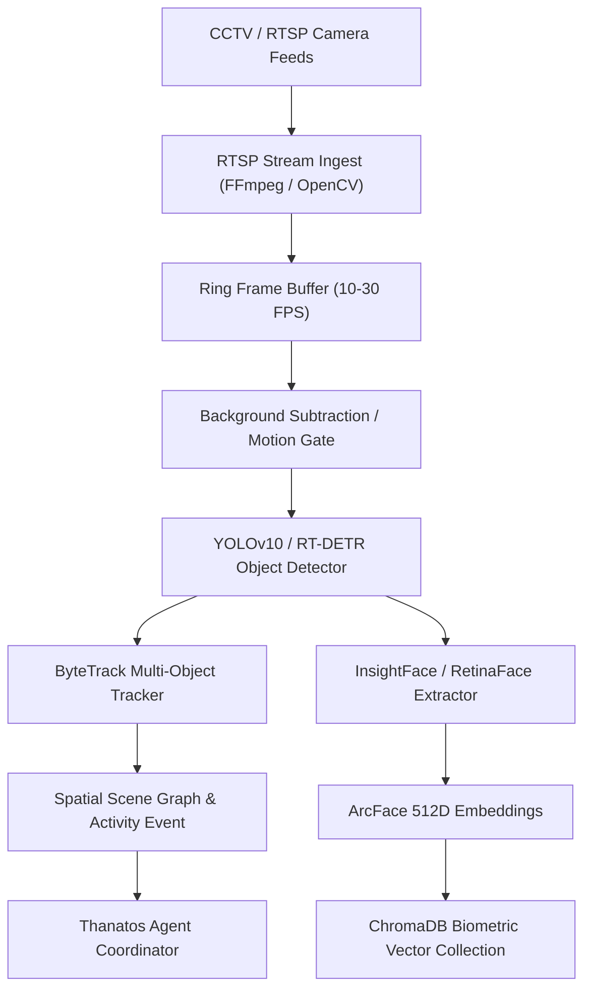

# Thanatos Future Vision & Scaling Architecture: Vision Intelligence, CCTV & Biometrics

This architectural blueprint outlines the roadmap for extending Thanatos into a physical-world perceptual assistant—capable of ingesting CCTV / RTSP video streams, performing real-time facial recognition, tracking objects, and indexing spatial telemetry.

---

## 1. Vision Perception Pipeline

---

## 2. Component Specifications

### 2.1 Video Ingest & Stream Multiplexing
- **Protocol**: RTSP, WebRTC, and local USB UVC cameras.
- **Engine**: Asynchronous OpenCV video capture with hardware decoding (`cuda` / `d3d11va` / `vaapi`).
- **Motion Gating**: Frame differencing prevents running heavy neural nets on static scenes, reducing compute load by ~85%.

### 2.2 Face Detection & Operator Recognition
- **Face Detection**: `RetinaFace` for robust detection under varied lighting and angles.
- **Feature Extraction**: `InsightFace` (ArcFace model) generating 512-dimensional normalized embeddings.
- **Biometric Matching**: Real-time cosine similarity search against enrolled faces stored in the vector database:
  - `Similarity > 0.65`: Operator Identified (`"Operator Authenticated"`).
  - `0.45 < Similarity <= 0.65`: Known Associate / Guest.
  - `Similarity <= 0.45`: Unknown Person (`"Security Alert: Unidentified Individual"`).

### 2.3 Object Tracking & Spatial Awareness
- **Detection Model**: YOLOv10 (Nano or Small variants for 30+ FPS on edge hardware).
- **Tracking Algorithm**: ByteTrack associating bounding boxes across frames with persistent track IDs.
- **Scene Memory**: Tracks entry/exit timestamps, bounding box trajectories, and object classes (e.g., packages, vehicles, phones, keys).

---

## 3. Data Storage & Querying

Spatial and biometric events are logged to the Hybrid Memory subsystem:
1. **Vector Collection (`thanatos_faces`)**: Stores face embeddings with metadata (`person_name`, `first_seen`, `confidence`).
2. **Relational Event Log (`cctv_events.json` / SQLite)**: Logs detection events with timestamps and snapshot file references.
3. **Query Interface**: The operator can ask naturally:
   - *"Did anyone arrive while I was away?"*
   - *"Where did I last leave my keys?"*
   - *"Show me when the delivery vehicle arrived."*

---

## 4. Hardware Scaling Requirements

| Capability | Minimum Hardware | Recommended Hardware |
| :--- | :--- | :--- |
| **1x 1080p RTSP Stream + YOLO Nano** | Intel i5 10th Gen (CPU) | NVIDIA GTX 1650 (4GB VRAM) |
| **4x 1080p Streams + Face ID + Tracking** | NVIDIA RTX 3060 (12GB VRAM) | NVIDIA RTX 4070 / RTX 4080 |
| **Edge Embedded Deployment** | NVIDIA Jetson Orin Nano (8GB) | NVIDIA Jetson Orin NX (16GB) |
