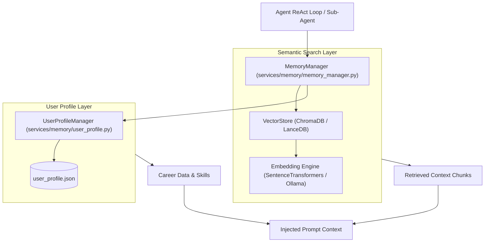

# Thanatos Memory & RAG Knowledge Subsystem

This document describes the long-term memory architecture, Retrieval-Augmented Generation (RAG) pipelines, ChromaDB vector store, and structured user profile management in Thanatos.

---

## Table of Contents

- [1. Overview](#1-overview)
- [2. Memory Subsystem Architecture](#2-memory-subsystem-architecture)
- [3. Vector Store & Semantic Embeddings](#3-vector-store--semantic-embeddings)
- [4. Structured User Profile & Career RAG](#4-structured-user-profile--career-rag)
- [5. Agent Memory Retrieval Pipeline](#5-agent-memory-retrieval-pipeline)
- [6. Python Code Examples](#6-python-code-examples)

---

## 1. Overview

Autonomous agents require both **episodic short-term context** (conversation turns) and **semantic long-term memory** (personal preferences, resumes, projects, and domain documents).

Thanatos provides a hybrid memory subsystem that combines:
1. **In-Memory Session Context**: Managed by `SessionManager` in `apps/api_server/core/session_manager.py`.
2. **Persistent Vector Store**: Powered by ChromaDB with cosine similarity search.
3. **Structured User Profile**: Fast-access Pydantic schema containing user skills, education, and career achievements.

---

## 2. Memory Subsystem Architecture



---

## 3. Vector Store & Semantic Embeddings

Located in `services/memory/vector_store.py` and `services/memory/embeddings.py`:
- **ChromaDB Vector Database**: Persists document vectors to disk (`data/vector_store/`).
- **Embedding Models**: Uses local HuggingFace `all-MiniLM-L6-v2` or Ollama embeddings (`nomic-embed-text`) to generate dense 384/768-dimensional vectors.
- **Cosine Similarity Retrieval**: Retrieves the top-$K$ most relevant text chunks matching the user query.

---

## 4. Structured User Profile & Career RAG

Located in `services/memory/user_profile.py`:
- Manages user career data specifically optimized for the `ResumeTailorSkill` and `JobApplicatorSkill`.
- Stores:
  - Personal Information (Name, Contact, Location)
  - Technical Skills (`["Python", "FastAPI", "Flutter", "RAG", "Docker"]`)
  - Featured Projects with impact metrics
  - Education and Certifications

---

## 5. Agent Memory Retrieval Pipeline

When a task such as *"Tailor my resume for this Senior Backend Engineer job description"* is executed:

1. **Job Description Analysis**: Key requirements (e.g. Python, distributed systems, vector search) are extracted.
2. **Semantic Similarity Query**: Queries `VectorStore` to retrieve relevant project highlights and code snippets.
3. **Profile Synthesis**: Combines structured profile data with retrieved project details into the prompt context.
4. **Tailored Output Generation**: Formulates customized resume sections and cover letters targeted precisely at the role.

---

## 6. Python Code Examples

### Adding Information to Memory
```python
from services.memory.memory_manager import memory_service

# Add general knowledge or past project notes
memory_service.add_memory(
    text="Built a distributed multi-agent system handling 10k requests/sec using FastAPI and Redis.",
    metadata={"category": "project", "technologies": ["FastAPI", "Redis"]}
)
```

### Searching Memory
```python
# Semantic search for relevant facts
results = memory_service.search("distributed backend projects", limit=3)
for doc in results:
    print(f"Match: {doc.content} (Score: {doc.score})")
```

### Retrieving User Profile for RAG
```python
profile = memory_service.user_profile.get_profile()
print(f"Candidate: {profile.name} - Skills: {', '.join(profile.skills)}")
```
