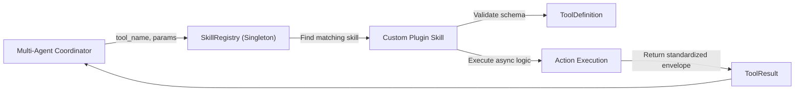

# Thanatos Plugin & Skill Development Guide

Welcome to the Thanatos Plugin Development Guide. This document provides a step-by-step tutorial and architectural reference for building, testing, registering, and distributing custom sub-agent skills and tools within the Thanatos AI Assistant Engine.

---

## 📑 Table of Contents

- [1. Architecture Overview](#1-architecture-overview)
- [2. The `BaseSkill` Interface](#2-the-baseskill-interface)
- [3. Defining Tools with `ToolDefinition`](#3-defining-tools-with-tooldefinition)
- [4. Executing Tools & Returning `ToolResult`](#4-executing-tools--returning-toolresult)
- [5. Registering Plugins with `SkillRegistry`](#5-registering-plugins-with-skillregistry)
- [6. Step-by-Step Tutorial: Building a Weather Skill](#6-step-by-step-tutorial-building-a-weather-skill)
- [7. Sandboxed Execution & Testing](#7-sandboxed-execution--testing)
- [8. Best Practices & Guidelines](#8-best-practices--guidelines)

---

## 1. Architecture Overview

In Thanatos, high-level user tasks are decomposed into discrete agent actions executed by **Skills**. A skill is a self-contained Python module that encapsulates one or more **Tools**.



Every skill inherits from `BaseSkill` and exposes standardized schemas compatible with OpenAI tool calling and local Ollama function calling formats.

---

## 2. The `BaseSkill` Interface

All plugins must implement the abstract class `BaseSkill` located at `plugins/base/skill_interface.py`:

```python
from abc import ABC, abstractmethod
from typing import List, Dict, Any
from shared.models.tool_definition import ToolDefinition
from shared.models.tool_result import ToolResult

class BaseSkill(ABC):
    """Abstract base class for all Thanatos sub-agent skills."""

    skill_name: str = "base_skill"

    @abstractmethod
    def get_tool_definitions(self) -> List[ToolDefinition]:
        """Return a list of ToolDefinition objects describing all tools in this skill."""
        ...

    @abstractmethod
    async def execute(self, tool_name: str, params: Dict[str, Any]) -> ToolResult:
        """Asynchronously execute a tool by name with the given parameters."""
        ...
```

---

## 3. Defining Tools with `ToolDefinition`

A `ToolDefinition` describes the tool's name, purpose, and parameter schema using standard JSON Schema formatting:

```python
from shared.models.tool_definition import ToolDefinition

tool_def = ToolDefinition(
    name="get_weather_forecast",
    description="Retrieve current weather and 3-day forecast for a given city.",
    parameters={
        "type": "object",
        "properties": {
            "city": {
                "type": "string",
                "description": "Name of the city (e.g. Pune, London, Tokyo)"
            },
            "units": {
                "type": "string",
                "enum": ["celsius", "fahrenheit"],
                "description": "Temperature units (default: celsius)"
            }
        },
        "required": ["city"]
    }
)
```

`ToolDefinition` automatically converts to standard OpenAI tool formats (`to_openai_tool()`) and local LLM prompt formats.

---

## 4. Executing Tools & Returning `ToolResult`

Your `execute()` method must always return a `ToolResult` instance:

```python
from shared.models.tool_result import ToolResult

# Success Response
return ToolResult.success_result(
    tool_name="get_weather_forecast",
    content={
        "city": "Pune",
        "temperature": 28,
        "condition": "Partly Cloudy",
        "humidity": "64%"
    }
)

# Error Response
return ToolResult.error_result(
    tool_name="get_weather_forecast",
    error="City 'Atlantis' was not found in weather database."
)
```

---

## 5. Registering Plugins with `SkillRegistry`

Thanatos uses a singleton `SkillRegistry` located at `plugins/base/registry.py`.

### Automatic Registration
Add your skill to `init_default_skills()` in `plugins/base/registry.py`:

```python
from plugins.system_skills.weather.weather_skill import WeatherSkill

registry.register(WeatherSkill())
```

### Dynamic Runtime Registration
You can also register skills dynamically at runtime:

```python
from plugins.base.registry import registry
from my_custom_package import MyCustomSkill

registry.register(MyCustomSkill())
```

---

## 6. Step-by-Step Tutorial: Building a Weather Skill

Let's build a complete, production-ready `WeatherSkill` plugin.

### Step 1: Create the Skill File
Create `plugins/system_skills/weather/weather_skill.py`:

```python
import logging
from typing import Any, Dict, List
import httpx

from plugins.base.skill_interface import BaseSkill
from shared.models.tool_definition import ToolDefinition
from shared.models.tool_result import ToolResult

logger = logging.getLogger(__name__)


class WeatherSkill(BaseSkill):
    """Skill for retrieving real-time weather forecasts."""

    @property
    def skill_name(self) -> str:
        return "weather_skill"

    def get_tool_definitions(self) -> List[ToolDefinition]:
        return [
            ToolDefinition(
                name="get_weather",
                description="Fetch current temperature and weather conditions for a specified city.",
                parameters={
                    "type": "object",
                    "properties": {
                        "city": {"type": "string", "description": "City name, e.g. Pune, New York"},
                        "units": {
                            "type": "string",
                            "enum": ["celsius", "fahrenheit"],
                            "description": "Temperature unit",
                            "default": "celsius",
                        },
                    },
                    "required": ["city"],
                },
            )
        ]

    async def execute(self, tool_name: str, params: Dict[str, Any]) -> ToolResult:
        if tool_name != "get_weather":
            return ToolResult.error_result(tool_name=tool_name, error=f"Unknown tool: {tool_name}")

        city = params.get("city", "").strip()
        units = params.get("units", "celsius")

        if not city:
            return ToolResult.error_result(tool_name=tool_name, error="Parameter 'city' is required.")

        try:
            # You can call an external weather API or simulate response
            temp = 28 if units == "celsius" else 82
            result_data = {
                "city": city,
                "temperature": f"{temp}°{'C' if units == 'celsius' else 'F'}",
                "condition": "Sunny",
                "humidity": "55%",
                "wind_speed": "12 km/h",
            }
            return ToolResult.success_result(tool_name=tool_name, content=result_data)
        except Exception as e:
            logger.exception("Failed to fetch weather for %s: %s", city, e)
            return ToolResult.error_result(tool_name=tool_name, error=str(e))
```

### Step 2: Register the Skill
In `plugins/base/registry.py`:

```python
from plugins.system_skills.weather.weather_skill import WeatherSkill

def init_default_skills() -> None:
    ...
    registry.register(WeatherSkill())
```

### Step 3: Write a Unit Test
Create `tests/unit/test_weather_skill.py`:

```python
import pytest
from plugins.system_skills.weather.weather_skill import WeatherSkill


@pytest.mark.asyncio
async def test_weather_skill_execution():
    skill = WeatherSkill()
    assert skill.skill_name == "weather_skill"
    assert len(skill.get_tool_definitions()) == 1

    result = await skill.execute("get_weather", {"city": "Pune", "units": "celsius"})
    assert result.success is True
    assert result.content["city"] == "Pune"
    assert "28°C" in result.content["temperature"]
```

---

## 7. Sandboxed Execution & Testing

For code-generating or dynamic skills (like `SelfImprovementSkill`), Thanatos provides an isolated sandbox runner (`sandbox/resource_limiter.py`):

```python
from sandbox.resource_limiter import ResourceLimitedRunner

runner = ResourceLimitedRunner(timeout_seconds=15, max_output_chars=4000)
result = await runner.run_command("pytest tests/unit/test_weather_skill.py")

if result["success"]:
    print("Plugin tests verified successfully in sandbox!")
```

---

## 8. Best Practices & Guidelines

1. **Idempotency & Safety**: Skills interacting with files or system state should check for destructive actions and fail safely.
2. **Strict Type Annotations**: Utilize Python type hints (`Dict[str, Any]`, `List[ToolDefinition]`) for clear contracts.
3. **Structured Logging**: Always log errors via `logging.getLogger(__name__)` with informative stack traces.
4. **Isolated Dependencies**: Keep external API calls asynchronous using `httpx` or `asyncio`.
5. **No Direct Standard Output**: Avoid `print()` statements in skills; always use `logger` to avoid interfering with MCP or stdio streams.
