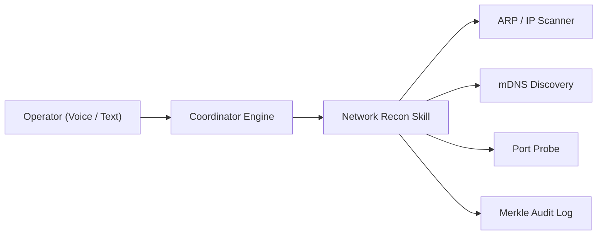

# Thanatos Security, Network Intelligence & Tactical Capabilities

This specification details the security architecture, device discovery mechanics, network surveillance interfaces, and defense capabilities planned for Thanatos.

---

## 1. Security Architecture & Threat Model

Thanatos is engineered as a private personal intelligence engine. Because it possesses OS execution, file manipulation, and network communication rights, strict boundaries are enforced to prevent unauthorized command injection or external interception.

### Defense-in-Depth Model:
1. **Perimeter Authentication**: Bearer token authentication gate on all endpoints (`apps/api_server/middleware/auth.py`). Unauthorized network packets are rejected with HTTP 401/403 before reaching the coordinator.
2. **Channel Encryption**: Strict WSS (WebSocket Secure) and HTTPS over TLS 1.3 to prevent ISP or local Wi-Fi eavesdropping.
3. **Execution Sandboxing**: Commands routed through subprocess limiters with process isolation, output buffer clamps, and timeout gates.
4. **Cryptographic Accountability**: Every tool invocation generates a SHA-256 Merkle leaf appended to the local tamper-evident audit ledger.

---

## 2. Network Intelligence & Device Discovery (Roadmap)

Thanatos is being architected with local network awareness so that the operator can inspect their environment, detect unauthorized connected devices, and perform diagnostic audits.

### Discovery Protocol Stack:
- **mDNS / Bonjour Service Discovery**: Scans local broadcast domain for smart devices, workstations, and network printers (`zeroconf` / Python socket).
- **ARP Table Sweep**: Inspects local subnet hardware addresses to maintain an inventory of online devices.
- **Port Inspection & Service Fingerprinting**: Performs safe, authorized TCP port probes (HTTP, SSH, RTSP, SMB) to classify unknown devices.

---

## 3. Data Lookup & OSINT Framework

To fulfill research directives (such as discovering background context on entities, companies, or public identifiers), Thanatos utilizes structured OSINT (Open Source Intelligence) pipelines:
- **Search Engine Query Aggregation**: Automated scraping via headless browser (`Playwright`) with anti-bot bypass.
- **DNS & WHOIS Lookup**: Resolves domain registration records, IP routing paths, and ASN ownership.
- **Entity Linking**: Integrates parsed entities into the vector database (`ChromaDB`) to establish long-term relational knowledge graphs.

---

## 4. Operational Ethics & Safety Gates

All network scanning and reconnaissance tools are governed by **safety gates**:
- Target confirmation prompt before initiating active port probes.
- Prohibition of destructive payloads or non-authorized credential attacks.
- Explicit operator confirmation required for external network mutations.
