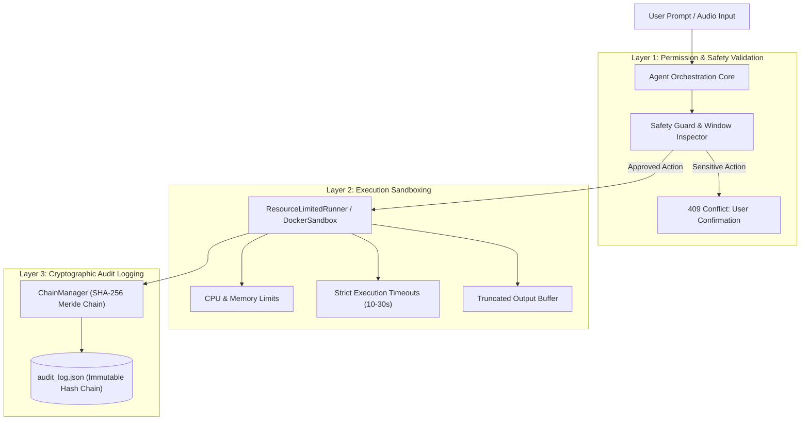
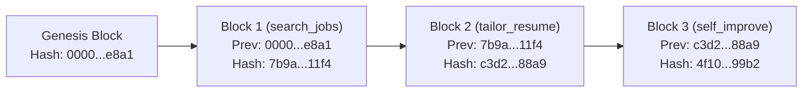

# Thanatos Security & Isolation Model

This document outlines the security architecture, sandboxing mechanisms, tamper-evident cryptographic audit trails, and privacy guarantees implemented in the Thanatos AI Assistant Engine.

---

## Table of Contents

- [1. Security Philosophy](#1-security-philosophy)
- [2. Multi-Layer Defense Architecture](#2-multi-layer-defense-architecture)
- [3. Code Execution Sandboxing](#3-code-execution-sandboxing)
- [4. Tamper-Evident Merkle Audit Trail](#4-tamper-evident-merkle-audit-trail)
- [5. OS Automation Safety Controls](#5-os-automation-safety-controls)
- [6. Local-First Privacy Guarantees](#6-local-first-privacy-guarantees)
- [7. Threat Matrix & Mitigations](#7-threat-matrix--mitigations)

---

## 1. Security Philosophy

Thanatos is designed to operate autonomously while executing system-level actions, self-improving code patches, and processing personal documents. Because autonomous agents can execute arbitrary commands and modify files, Thanatos implements a **Zero-Trust Defense-in-Depth** model:

1. **Principle of Least Privilege**: Agents only receive permissions required for their specific skill.
2. **Explicit User Confirmation**: Sensitive OS actions (e.g. typing text into unknown windows or closing running apps) require user confirmation.
3. **Immutable Auditability**: Every agent decision and tool execution is cryptographically signed and chained.
4. **Local Data Sovereignty**: All LLM inference, voice processing, and RAG embeddings remain local by default.

---

## 2. Multi-Layer Defense Architecture



---

## 3. Code Execution Sandboxing

When self-improving agents (like `SelfImprovementSkill`) generate code or run tests, execution is isolated through dedicated runners:

### Resource-Limited Subprocess Runner (`sandbox/resource_limiter.py`)
- **Timeout Caps**: Hard execution limit (default: 15s) terminates stuck or runaway processes via `SIGKILL`.
- **Output Bounds**: Caps standard output/error to prevent buffer overflow or denial-of-service (max 4,000 characters).
- **Process Isolation**: Spawns isolated subprocesses with non-inherited environments.

### Containerized Docker Sandbox (`sandbox/docker_manager.py`)
- **Container Isolation**: Runs code in a disposable `python:3.12-slim` container with read-only root filesystems and restricted network access.
- **Volume Sandboxing**: Only target scratch directories are mounted.

---

## 4. Tamper-Evident Merkle Audit Trail

Every tool invocation, model decision, and code patch is recorded in an immutable cryptographic audit ledger (`audit/chain_manager.py`):

### Block Structure
Each audit block contains:
- `index`: Monotonically increasing integer.
- `event_type`: Event categorization (e.g., `AGENT_ACTION`, `TOOL_EXECUTION`, `CODE_PATCH`).
- `data`: Complete payload (agent name, tool name, arguments, timestamp).
- `previous_hash`: SHA-256 hash of the preceding block.
- `hash`: Current block hash calculated as:
  $$\text{Hash} = \text{SHA256}(\text{JSON}(\text{data}) + \text{previous\_hash})$$



### Chain Verification
The `verify_integrity()` method validates that no block has been altered, deleted, or inserted:

```python
from audit.chain_manager import ChainManager

chain = ChainManager()
if chain.verify_integrity():
    print("Audit log integrity verified: 100% authentic.")
else:
    raise SecurityError("Audit trail tampering detected!")
```

---

## 5. OS Automation Safety Controls

The OS Automation layer (`services/os_automation/`) features programmatic safety gates to prevent unintended actions:

1. **Active Window Inspection**: Before typing text or dispatching keyboard shortcuts, the `InputController` inspects the foreground window title.
2. **Safety Check Exception (`SafetyCheckRequired`)**: If text typing is requested without an explicit `force=True` flag, a `409 Conflict` response is sent to the client requiring human approval.
3. **Volume Clamping**: System volume changes are strictly bound between 0 and 100%.

---

## 6. Local-First Privacy Guarantees

| Subsystem | Execution Method | Data Destination |
| :--- | :--- | :--- |
| **LLM Brain** | Local Ollama Engine (e.g. `qwen2.5:7b`, `deepseek-r1:7b`) | 100% Local (No external API calls) |
| **Vector Store (RAG)** | Local ChromaDB / LanceDB on disk | Stored locally in `data/memory/` |
| **Voice Transcription** | Faster-Whisper on CPU/CUDA | Local audio processing |
| **Speech Synthesis** | Edge-TTS / Local Coqui | Direct streaming to client |
| **User Profile** | Encrypted JSON on local filesystem | Never uploaded to cloud |

---

## 7. Threat Matrix & Mitigations

| Threat Vector | Potential Impact | Thanatos Mitigation |
| :--- | :--- | :--- |
| **Prompt Injection** | Rogue model instructions attempting file deletion | Tool schemas validate parameter boundaries; critical tools enforce confirmation. |
| **Runaway Code Execution** | Infinite loops during agent self-testing | Strict 15-second subprocess timeout kills runaway tasks. |
| **Tampered History** | Malicious alteration of agent activity records | SHA-256 Merkle chain verification detects modified blocks immediately. |
| **Sensitive Window Keystrokes** | Keystrokes typed into unintended browser/terminal windows | Active window inspection and mandatory confirmation dialog. |
| **Data Leakage via Cloud APIs** | Personal resume or career data sent to 3rd-party servers | Default Ollama runtime keeps all context within the local machine. |
