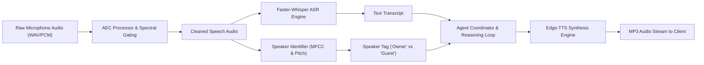

# Thanatos Speech Intelligence & Voice Engine

This document details the architecture, audio processing pipeline, Acoustic Echo Cancellation (AEC), multi-speaker diarization, and speech synthesis capabilities of the Thanatos Voice Subsystem.

---

## Table of Contents

- [1. Overview](#1-overview)
- [2. Voice Pipeline Architecture](#2-voice-pipeline-architecture)
- [3. Acoustic Echo Cancellation (AEC) & Noise Filtering](#3-acoustic-echo-cancellation-aec--noise-filtering)
- [4. Speaker Identification & Diarization](#4-speaker-identification--diarization)
- [5. Speech-to-Text (ASR) with Faster-Whisper](#5-speech-to-text-asr-with-faster-whisper)
- [6. Text-to-Speech (TTS) with Neural Voices](#6-text-to-speech-tts-with-neural-voices)
- [7. Enrolling the Owner Voice Profile](#7-enrolling-the-owner-voice-profile)
- [8. Client Voice Overlay Integration](#8-client-voice-overlay-integration)

---

## 1. Overview

Thanatos provides a full-duplex voice intelligence system designed for real-world acoustic environments. Unlike simple speech wrappers, Thanatos incorporates:
- **Acoustic Echo Cancellation (AEC)** to prevent speaker audio loopback.
- **Voice Activity Detection (VAD)** to segment speech accurately.
- **Speaker Diarization** to identify whether the speaker is the device owner or a third party ("Owner (You)" vs "Guest Speaker").
- **Neural TTS Synthesis** for ultra-responsive, natural vocal feedback.

---

## 2. Voice Pipeline Architecture



---

## 3. Acoustic Echo Cancellation (AEC) & Noise Filtering

Located in `services/speech/aec.py`, the `AECProcessor`:
1. **Spectral Gating**: Estimates background stationary noise profile and applies non-linear attenuation across frequency bins.
2. **Dynamic Range Compression**: Prevents audio clipping when speaking loudly into near-field microphones.
3. **Echo Suppression**: Suppresses system audio feedback generated by simultaneous TTS playback.

---

## 4. Speaker Identification & Diarization

Located in `services/speech/speaker_id.py`, the `SpeakerIdentifier` enables multi-person voice awareness:

### Feature Extraction
- Extracts fundamental frequency ($F_0$ pitch), Mel-Frequency Cepstral Coefficients (MFCCs), and spectral centroid features.
- Computes Euclidean distance against enrolled owner voice embeddings:
  $$D = \sqrt{\sum_{i=1}^{N} (f_{\text{input}, i} - f_{\text{owner}, i})^2}$$

### Speaker Classification
- If $D \le \text{Threshold}$ (default `0.35`): Classified as `"Owner (You)"`.
- If $D > \text{Threshold}$: Classified as `"Guest Speaker"`.
- Enables Thanatos to follow commands such as *"Summarize what the other speaker in the meeting just said"*.

---

## 5. Speech-to-Text (ASR) with Faster-Whisper

Located in `services/speech/stt.py`:
- Uses quantized CTranslate2-accelerated Whisper models (`base`, `small`, or `medium`).
- Automatically detects spoken language with timestamps and segment-level confidence scores.

---

## 6. Text-to-Speech (TTS) with Neural Voices

Located in `services/speech/tts.py`:
- Integrates `edge-tts` to deliver lifelike neural voices without GPU overhead.
- Default voice: `en-US-ChristopherNeural` (customizable in Flutter settings to `en-US-JennyNeural`, `en-GB-SoniaNeural`, etc.).
- Outputs streaming MP3 bytes directly over HTTP (`/speech/synthesize`).

---

## 7. Enrolling the Owner Voice Profile

To enroll your voice profile:

### Via REST API
```bash
curl -X POST "http://localhost:8000/speech/enroll-voice" \
  -F "file=@my_voice_sample.wav"
```

### Via Flutter Client
1. Open the Flutter client.
2. Navigate to **Settings** > **Voice Profile**.
3. Tap **Record Sample** and speak for 5 seconds.
4. The app uploads the sample, extracts your voice signature, and saves the profile to `services/speech/profiles/owner_voice.json`.

---

## 8. Client Voice Overlay Integration

The Flutter client provides an interactive voice overlay (`apps/client_flutter/lib/ui/widgets/voice_overlay.dart`) featuring:
- Live animated audio waveform visualizer.
- Real-time AEC & VAD status indicators.
- Live speaker badge display (`Owner` / `Guest`).
