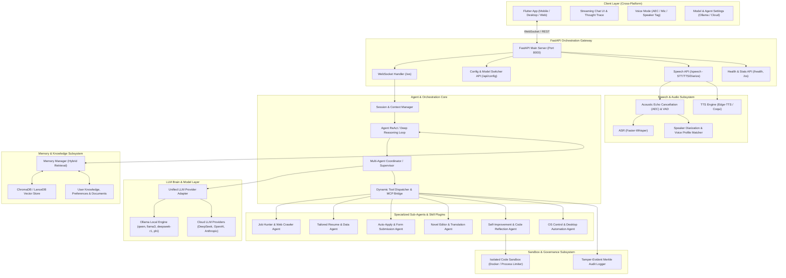
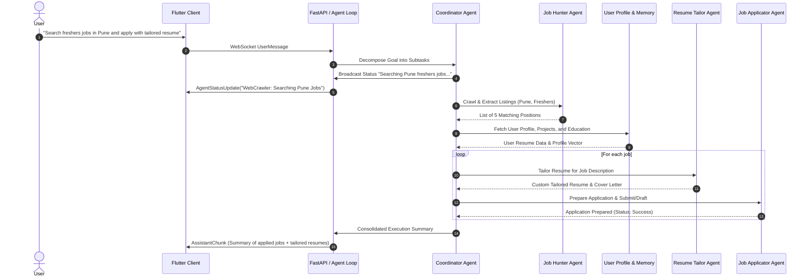

# Thanatos: System Architecture & Workflow Specification

## 1. Executive Summary

**Thanatos** is an autonomous, multi-agent AI assistant system built with a modular, service-oriented architecture. It integrates local-first LLM orchestration (defaulting to Ollama with configurable models), scalable multi-agent task execution, Retrieval-Augmented Generation (RAG) memory, multi-speaker voice intelligence with Acoustic Echo Cancellation (AEC) and Speaker Diarization, self-improvement code loops, and a cross-platform Flutter client (Android, iOS, Web, Windows, macOS, Linux).

---

## 2. Global Architecture Diagram

---

## 3. Module Breakdown and File Inventory

### Module 1: `apps/api_server` — API Gateway & Session Orchestration
**Purpose**: Primary backend entrypoint providing async WebSockets, REST endpoints, session state management, and real-time streaming to clients.

| File | Purpose & Responsibilities |
|---|---|
| `apps/api_server/main.py` | FastAPI application initialization, CORS middleware, lifespan events, and router registration. |
| `apps/api_server/core/agent_loop.py` | Asynchronous ReAct orchestration loop: receives user messages, executes planning steps, invokes tools, and streams response chunks/events. |
| `apps/api_server/core/dispatcher.py` | Routes tool calls between server-side skills, plugin registry, MCP server, and client-side actions. |
| `apps/api_server/core/session_manager.py` | Maintains active conversation state, short-term history, active generators, and user context. |
| `apps/api_server/core/config.py` | Pydantic runtime settings for the API server (ports, timeouts, heartbeat). |
| `apps/api_server/routes/websocket.py` | Handles bidirectional `/ws` WebSocket streaming, ping-pong heartbeats, and client disconnects. |
| `apps/api_server/routes/speech.py` | REST endpoints for audio upload, speech transcription, speaker diarization, and TTS synthesis. |
| `apps/api_server/routes/config.py` | REST endpoints for dynamically inspecting and switching LLM models (Ollama/DeepSeek/OpenAI) and updating config. |
| `apps/api_server/routes/health.py` | System health checks and status diagnostics. |
| `apps/api_server/schemas/agent_models.py` | Data models for agent planning, reasoning traces, and multi-agent coordination. |
| `apps/api_server/schemas/tool_models.py` | Canonical `ToolCall`, `ToolResult`, and tool execution envelopes. |
| `apps/api_server/schemas/websocket_models.py` | Wire protocol schemas (`UserMessage`, `AssistantChunk`, `AgentStatusUpdate`, `ToolCallRequest`, `ErrorMessage`). |

---

### Module 2: `services/llm_brain` & `services/local_llm` — Unified Model Provider & Planner
**Purpose**: Abstracts model execution across local Ollama instances (e.g. 7B, 14B, 32B models) and cloud APIs with deep reasoning and structured tool calling.

| File | Purpose & Responsibilities |
|---|---|
| `services/llm_brain/provider.py` | Unified LLM provider interface (`UnifiedLLMProvider`) supporting Ollama, DeepSeek, OpenAI, and Anthropic with automatic tool-call conversion. |
| `services/llm_brain/deepseek_planner.py` | Multi-step reasoning planner with retry loops and reasoning trace extraction. |
| `services/llm_brain/coordinator.py` | Multi-Agent Supervisor: decomposes high-level user tasks (e.g., job hunting + resume tailoring + applying) into sub-agent task graphs. |
| `services/local_llm/ollama_client.py` | Resilient Ollama client: handles model listings, health, chat completions, streaming, and tool schemas. |
| `services/local_llm/prompt_builder.py` | Constructs optimized prompt templates with system roles, context injection, and structured output formatting. |
| `services/local_llm/tool_parser.py` | Robust parsing and repair for tool calls generated by smaller 7B/14B models (extracting JSON/XML function calls from model text). |

---

### Module 3: `plugins/` — Scalable Multi-Agent Skills & Tool Ecosystem
**Purpose**: Pluggable domain-specific agents and skills conforming to `BaseSkill`.

| File / Package | Purpose & Responsibilities |
|---|---|
| `plugins/base/skill_interface.py` | Base abstract class `BaseSkill` that every agent/skill implements (`get_tool_definitions()`, `execute()`). |
| `plugins/base/registry.py` | Singleton skill registry for auto-discovery and tool execution dispatch. |
| `plugins/system_skills/job_hunter/` | **Web Crawl & Job Search Agent**: Searches job portals, scrapes listings in specified locations (e.g. Pune freshers), parses qualifications and application links. |
| `plugins/system_skills/resume_tailor/` | **Resume & Cover Letter Agent**: Queries user vector memory for projects/skills, tailors resumes to match job descriptions, and formats outputs (Markdown/JSON). |
| `plugins/system_skills/job_applicator/` | **Job Application Agent**: Formulates auto-apply payloads, logs applications, and prepares automated emails/forms. |
| `plugins/system_skills/novel_agent/` | **Novel Editor & Translator Agent**: Translates web novel raw chapters maintaining terminology glossaries, refines prose, and checks character consistency. |
| `plugins/system_skills/self_improvement/` | **Self-Improvement / Code Agent**: Inspects Thanatos source code, analyzes test failures or improvement requests, creates safe patches, and runs test validations. |
| `plugins/system_skills/os_control/` | System monitoring, process control, file operations, and window/input automation. |

---

### Module 4: `services/memory` — Vector Store & RAG Knowledge Layer
**Purpose**: Long-term memory, semantic search, user profile storage, and context retrieval.

| File | Purpose & Responsibilities |
|---|---|
| `services/memory/memory_manager.py` | High-level memory facade for adding user facts, preferences, resumes, and performing semantic search. |
| `services/memory/vector_store.py` | ChromaDB / LanceDB vector store adapter with persistent local storage and cosine similarity search. |
| `services/memory/embeddings.py` | Local and API-based embedding generation (`sentence-transformers` / HuggingFace / Ollama embeddings). |
| `services/memory/user_profile.py` | Structured user profile manager (personal info, work experience, skill tags, project summaries) for instant agent RAG retrieval. |

---

### Module 5: `services/speech` — Audio Intelligence (ASR, TTS, AEC, Speaker Diarization)
**Purpose**: Real-time voice interaction with acoustic filtering and multi-speaker awareness.

| File | Purpose & Responsibilities |
|---|---|
| `services/speech/speech_service.py` | Unified facade combining STT, TTS, AEC filtering, and Speaker Diarization. |
| `services/speech/stt.py` | Speech-to-Text using `faster-whisper` with beam search and language detection. |
| `services/speech/tts.py` | Text-to-Speech using `edge-tts` with selectable neural voices and audio byte streaming. |
| `services/speech/audio_utils.py` | Audio format normalization, sample rate conversion, and WAV/MP3 validators. |
| `services/speech/speaker_id.py` | **Speaker Diarization & Voice Matching**: Extracts voice spectral signatures, enrolls the user's voice profile, distinguishes "User" from "Guest/Other", and parses multi-speaker dialogue. |
| `services/speech/aec.py` | **Acoustic Echo Cancellation (AEC) & Noise Suppressor**: Removes background noise, feedback echo, and isolates speech segments. |

---

### Module 6: `sandbox/` & `audit/` — Safe Code Execution & Security Audit
**Purpose**: Secure sandboxed test execution for self-improvement and tamper-evident audit trails.

| File | Purpose & Responsibilities |
|---|---|
| `sandbox/docker_manager.py` | Containerized environment runner for testing generated code and patches in isolation. |
| `sandbox/resource_limiter.py` | Subprocess resource limiter (CPU time, memory caps, timeout guards) for safe local code execution. |
| `audit/audit_logger.py` | Structured event logger writing cryptographic hashes for every tool call and agent decision. |
| `audit/chain_manager.py` | Merkle-chain verification to guarantee audit logs are immutable and tamper-evident. |
| `audit/crypto_utils.py` | SHA-256 signing and verification helpers. |

---

### Module 7: `apps/client_flutter` — Cross-Platform Client Application
**Purpose**: Responsive Flutter UI running seamlessly across Desktop (Windows, macOS, Linux) and Mobile (Android, iOS).

| File | Purpose & Responsibilities |
|---|---|
| `apps/client_flutter/lib/main.dart` | Flutter application entrypoint, theme setup, and Riverpod provider scope. |
| `apps/client_flutter/lib/config.dart` | Client configuration (API server URL, WebSocket host, default voice). |
| `apps/client_flutter/lib/ui/screens/chat_screen.dart` | Main screen featuring chat history, live agent status breadcrumbs, input box, and mic button. |
| `apps/client_flutter/lib/ui/screens/settings_screen.dart` | Configuration screen for switching LLM model (Ollama 7B/14B/30B/Cloud), setting Ollama URL, and managing voice profiles. |
| `apps/client_flutter/lib/ui/widgets/chat_bubble.dart` | Render Markdown messages, code blocks with syntax highlighting, and speaker tags. |
| `apps/client_flutter/lib/ui/widgets/agent_status_tracker.dart` | Visual breadcrumb component showing live multi-agent subtask progress. |
| `apps/client_flutter/lib/ui/widgets/voice_overlay.dart` | Interactive voice interaction modal with mic waveform, AEC status, and speaker identification indicators. |
| `apps/client_flutter/lib/state/chat_provider.dart` | Riverpod state notifier managing WebSocket connection, message stream, and active tool updates. |
| `apps/client_flutter/lib/services/websocket_service.dart` | WebSocket client with automatic reconnection and heartbeat handling. |
| `apps/client_flutter/lib/services/speech_service.dart` | Client-side audio recording and playback bridge. |

---

## 4. End-to-End Workflows

### Workflow A: Complex Job Search & Auto-Tailored Application

---

## 5. Model Configuration & Local Hardware Optimization

Thanatos supports dynamic hardware scaling:
* **7B / 8B Models** (`qwen2.5:7b`, `llama3.1:8b`, `mistral:7b`): Best for low-resource laptops; uses tool-call fallback parsing if native tool-calling is limited.
* **14B / 32B Models** (`deepseek-r1:14b`, `qwen2.5:14b`, `qwen2.5:32b`): Balanced reasoning and fast local execution.
* **Cloud Fallback / Hybrid**: DeepSeek-V3/R1, OpenAI, or Anthropic can be configured in `config/settings.py` or directly changed in the Flutter Settings Screen.
